# 麒忆智脑

面向银河麒麟操作系统的 OS Agent 多源融合偏好与知识记忆优化方案

技 术 方 案

赛题编号  XA-202612

赛题名称  OS Agent 记忆优化及高效应用研究

作品名称  麒忆智脑 (工程代号 MOKOA)

文档类型  技术方案 (含技术文档、效果验证报告与用户手册)

文档版本  v1.0

编制日期  2026 年 9 月

文档用途  2026 挑战杯揭榜挂帅专项赛参赛作品提交件

- [第 1 章  需求分析](#第-1-章-需求分析)
  - [1.1  赛题背景](#11-赛题背景)
  - [1.2  核心痛点](#12-核心痛点)
  - [1.3  需求分解](#13-需求分解)
  - [1.4  设计目标与量化指标](#14-设计目标与量化指标)
  - [1.5  设计原则：收缩而非堆叠](#15-设计原则收缩而非堆叠)
- [第 2 章  总体架构](#第-2-章-总体架构)
  - [2.1  三层架构](#21-三层架构)
  - [2.2  模块清单](#22-模块清单)
  - [2.3  统一记忆分类](#23-统一记忆分类)
  - [2.4  端到端数据流](#24-端到端数据流)
  - [2.5  接口契约与协作规则](#25-接口契约与协作规则)
- [第 3 章  多源数据整合](#第-3-章-多源数据整合)
  - [3.1  五段式摄取管线](#31-五段式摄取管线)
  - [3.2  清洗：从噪声到可用文本](#32-清洗从噪声到可用文本)
  - [3.3  标准化：来源专属的稳定表示](#33-标准化来源专属的稳定表示)
  - [3.4  质量校验：分值与门控](#34-质量校验分值与门控)
  - [3.5  中转库：审计、去重与生命周期](#35-中转库审计去重与生命周期)
  - [3.6  机制创新点：多源清洗与质量门控](#36-机制创新点多源清洗与质量门控)
- [第 4 章  偏好记忆动态捕捉与版本化管理](#第-4-章-偏好记忆动态捕捉与版本化管理)
  - [4.1  为什么偏好不能用自由文本表示](#41-为什么偏好不能用自由文本表示)
  - [4.2  封闭偏好键空间](#42-封闭偏好键空间)
  - [4.3  规则与大模型融合抽取](#43-规则与大模型融合抽取)
  - [4.4  可解释置信度](#44-可解释置信度)
  - [4.5  场景隔离的版本链](#45-场景隔离的版本链)
  - [4.6  结构化画像与 Agent 注入](#46-结构化画像与-agent-注入)
  - [4.7  机制创新点：偏好提取算法](#47-机制创新点偏好提取算法)
- [第 5 章  知识记忆结构化整合与检索](#第-5-章-知识记忆结构化整合与检索)
  - [5.1  统一记忆 Schema 与字段映射](#51-统一记忆-schema-与字段映射)
  - [5.2  新旧知识冲突消解](#52-新旧知识冲突消解)
  - [5.3  关联检索与 RAG](#53-关联检索与-rag)
  - [5.4  记忆策略评分](#54-记忆策略评分)
  - [5.5  机制创新点：冲突处理与关联检索](#55-机制创新点冲突处理与关联检索)
- [第 6 章  端侧轻量化部署与麒麟适配](#第-6-章-端侧轻量化部署与麒麟适配)
  - [6.1  Embedding 统一接口](#61-embedding-统一接口)
  - [6.2  银河麒麟 SDK 适配](#62-银河麒麟-sdk-适配)
  - [6.3  延迟控制与轻量化](#63-延迟控制与轻量化)
  - [6.4  端侧部署形态对照](#64-端侧部署形态对照)
  - [6.5  机制创新点：端侧轻量化适配](#65-机制创新点端侧轻量化适配)
- [第 7 章  敏感信息过滤与自然语言精准遗忘](#第-7-章-敏感信息过滤与自然语言精准遗忘)
  - [7.1  设计目标：隐私与记忆分离](#71-设计目标隐私与记忆分离)
  - [7.2  双层检测引擎](#72-双层检测引擎)
    - [7.2.1  正则层](#721-正则层)
    - [7.2.2  语义层](#722-语义层)
  - [7.3  哈希占位符与索引加密](#73-哈希占位符与索引加密)
  - [7.4  自然语言精准遗忘](#74-自然语言精准遗忘)
  - [7.5  上下文维护](#75-上下文维护)
  - [7.6  机制创新点：隐私分离与精准遗忘](#76-机制创新点隐私分离与精准遗忘)
- [第 8 章  记忆流转机制](#第-8-章-记忆流转机制)
  - [8.1  三层记忆与门控条件](#81-三层记忆与门控条件)
  - [8.2  与短期记忆、中期记忆的交互逻辑](#82-与短期记忆中期记忆的交互逻辑)
  - [8.3  热度模型与长期化](#83-热度模型与长期化)
  - [8.4  热度衰减与一致性](#84-热度衰减与一致性)
  - [8.5  机制创新点：记忆流转与长期化](#85-机制创新点记忆流转与长期化)
- [第 9 章  量化评测与效果验证](#第-9-章-量化评测与效果验证)
  - [9.1  评测体系与阶段划分](#91-评测体系与阶段划分)
  - [9.2  项目前期：自制功能覆盖演示集](#92-项目前期自制功能覆盖演示集)
    - [9.2.1  数据集构成](#921-数据集构成)
    - [9.2.2  总览与分功能结果](#922-总览与分功能结果)
    - [9.2.3  赛题必做案例](#923-赛题必做案例)
    - [9.2.4  未通过项定位](#924-未通过项定位)
  - [9.3  项目后期：公开开源数据集抽样验证](#93-项目后期公开开源数据集抽样验证)
    - [9.3.1  数据集清单](#931-数据集清单)
    - [9.3.2  知识检索召回率](#932-知识检索召回率)
    - [9.3.3  知识检索响应时间](#933-知识检索响应时间)
    - [9.3.4  知识冲突处理正确率](#934-知识冲突处理正确率)
    - [9.3.5  偏好提取准确率](#935-偏好提取准确率)
    - [9.3.6  本轮评测的可复现信息](#936-本轮评测的可复现信息)
  - [9.4  四项核心指标汇总](#94-四项核心指标汇总)
  - [9.5  对比实验与消融设计](#95-对比实验与消融设计)
  - [9.6  银河麒麟 V11 真机验收](#96-银河麒麟-v11-真机验收)
    - [9.6.1  验收环境约束](#961-验收环境约束)
  - [9.7  未达标项与优化方向](#97-未达标项与优化方向)
  - [9.8  结果说明与适用范围](#98-结果说明与适用范围)
- [第 10 章  应用场景与案例](#第-10-章-应用场景与案例)
  - [10.1  场景一：桌面办公助手](#101-场景一桌面办公助手)
    - [10.1.1  偏好沉淀过程](#1011-偏好沉淀过程)
  - [10.2  场景二：系统操作安全策略](#102-场景二系统操作安全策略)
  - [10.3  场景三：跨场景工具选择共存](#103-场景三跨场景工具选择共存)
  - [10.4  场景四：知识沉淀与复用](#104-场景四知识沉淀与复用)
- [第 11 章  安装部署指南](#第-11-章-安装部署指南)
  - [11.1  环境要求](#111-环境要求)
  - [11.2  Windows 开发机部署](#112-windows-开发机部署)
  - [11.3  银河麒麟 V11 部署](#113-银河麒麟-v11-部署)
    - [11.3.1  环境变量](#1131-环境变量)
    - [11.3.2  启动与健康检查](#1132-启动与健康检查)
    - [11.3.3  一键验收](#1133-一键验收)
  - [11.4  前端启动](#114-前端启动)
  - [11.5  关键配置项](#115-关键配置项)
  - [11.6  常见问题排查](#116-常见问题排查)
- [第 12 章  用户手册](#第-12-章-用户手册)
  - [12.1  界面总览](#121-界面总览)
  - [12.2  核心操作流程](#122-核心操作流程)
    - [12.2.1  写入记忆](#1221-写入记忆)
    - [12.2.2  查看偏好画像](#1222-查看偏好画像)
    - [12.2.3  知识检索](#1223-知识检索)
    - [12.2.4  自然语言遗忘](#1224-自然语言遗忘)
  - [12.3  接口清单](#123-接口清单)
- [第 13 章  创新点与应用价值](#第-13-章-创新点与应用价值)
  - [13.1  技术创新性](#131-技术创新性)
  - [13.2  实用性](#132-实用性)
- [第 14 章  已知约束与演进路线](#第-14-章-已知约束与演进路线)
  - [14.1  当前已知约束](#141-当前已知约束)
  - [14.2  演进路线](#142-演进路线)
  - [14.3  结论](#143-结论)
- [附录 A  术语表](#附录-a-术语表)
- [附录 B  证据索引](#附录-b-证据索引)
## 目录

## 第 1 章  需求分析

### 1.1  赛题背景

基于麒麟操作系统的 OS Agent 是智能交互系统的核心组件，其记忆模块中的**偏好记忆**与**知识记忆**是支撑个性化服务适配、知识沉淀复用的核心载体。工具调用执行结果是两类记忆的核心数据源之一，记忆同时还来源于用户手动配置、跨场景行为数据等多类渠道。

偏好记忆刻画用户如何完成工作，包括操作习惯、输出风格与安全策略；知识记忆沉淀工作流程、历史案例与可复用模板。二者数据源高度重叠，但读写语义并不相同：知识适合关联检索与冲突融合，偏好则必须能够按字段更新、按场景解析、按版本回溯。若用一段自由文本同时承担两类记忆，个性化服务很难稳定。

### 1.2  核心痛点

发榜方案指出的问题可归纳为三组，本项目逐一对应解决：

| 痛点类别 | 具体表现 | 本项目的应对 |
| --- | --- | --- |
| 结构化不足 | 工具调用执行结果结构化不足、数据质量参差不齐，导致偏好提取不精准，工具选择一类偏好尤为明显 | 五段式摄取管线，配合封闭偏好键空间与质量门控 |
| 多源不一致 | 用户行为捕捉不全面、跨场景数据不一致、配置版本混乱 | 场景隔离版本链，配合统一记忆 Schema 与可解释置信度 |
| 沉淀与检索低效 | 新旧知识冲突滞后、关联检索精度有限 | 冲突消解器，配合向量检索与记忆热度晋升门控 |

### 1.3  需求分解

赛题内容给出 7 项明确要求，本项目的实现与证据对应关系如下：

| 编号 | 赛题要求 | 本项目实现 | 对应章节 |
| --- | --- | --- | --- |
| (1) | 多源数据整合：统一接入、清洗、格式标准化与质量校验 | 五段式摄取管线与 SQLite staging 中转库 | 第 3 章 |
| (2) | 偏好记忆动态捕捉：自动提取与版本化管理，跨场景适配与回溯 | 封闭键空间、融合抽取与场景隔离版本链 | 第 4 章 |
| (3) | 知识记忆结构化整合：新旧冲突处理、关联检索优化 | 统一记忆 Schema、冲突消解与向量检索 | 第 5 章 |
| (4) | 端侧部署：调用银河麒麟 Embedding SDK，检索延迟 ≤500ms | Embedding 统一接口与麒麟 SDK 适配层 | 第 6 章 |
| (5) | 敏感信息识别与过滤、自然语言指令驱动精准遗忘 | 双层检测引擎、隐私记忆分离与自然语言遗忘解析 | 第 7 章 |
| (6) | 兼容短期、中期记忆间的数据流转 | 三层记忆、热度晋升与长期化 | 第 8 章 |
| (7) | 量化评测机制与完整测试报告 | 标准化数据集、四指标评测与消融对比实验 | 第 9 章 |

### 1.4  设计目标与量化指标

赛题评选标准中性能指标占 25 分，本项目将其作为设计约束而非事后补充：

| 核心指标 | 目标值 | 评测口径 |
| --- | --- | --- |
| 偏好提取准确率 | ≥ 85% | 字段级 F1（主口径）与样本完整匹配率（严口径） |
| 知识检索召回率 | ≥ 85% | Recall@K，知识类型记忆关联检索 |
| 知识检索响应时间 | ≤ 500ms | HTTP 端到端检索耗时 |
| 知识冲突处理正确率 | ≥ 88% | 冲突场景判定正确比例 |

除上述硬指标外，项目还遵循三项工程目标：**端侧可行**（不假设始终可访问云端模型，必须存在离线降级路径）、**可解释**（置信度、版本与冲突裁决过程可人工核算与复核）、**可回归**（每项机制具备自动化测试与消融对照）。

### 1.5  设计原则：收缩而非堆叠

在一个可交付的时间窗内，架构遵循「收缩而非堆叠」，避免功能重叠与解释成本膨胀：

- **一个核心**：自研 Memory Orchestrator（记忆编排核心），而非并行堆叠多个开源记忆框架。

- **三类记忆**：偏好记忆、知识记忆、生命周期流转，三者在存储与读取路径上分离。

- **三个参考**：借鉴 MemoryOS 的分层与热度晋升、Mem0 的偏好事实抽取、Cognee 的知识结构化思路，仅吸收设计理念，不作为运行时依赖。

- **自研不可替代部分**：记忆分类、冲突消解、多源清洗、麒麟 Embedding 适配、混合存储。

该原则的现实含义是：**不接入** Supermemory、Zep、LangMem 等同类并行适配器。它们的职责与本方案的摄取、冲突与检索模块高度重叠，接入后既不能提升指标，又会在答辩环节显著增加解释成本。

## 第 2 章  总体架构

### 2.1  三层架构

系统按职责分为三层，下层可插拔、中层自研、上层面向用户与集成方。分层的目的不是形式上的整洁，而是**把易变的部分（模型、向量库、适配器）与稳定的部分（编排、分类、冲突消解、隐私处理）隔离开**，使端侧部署形态切换不影响业务逻辑。

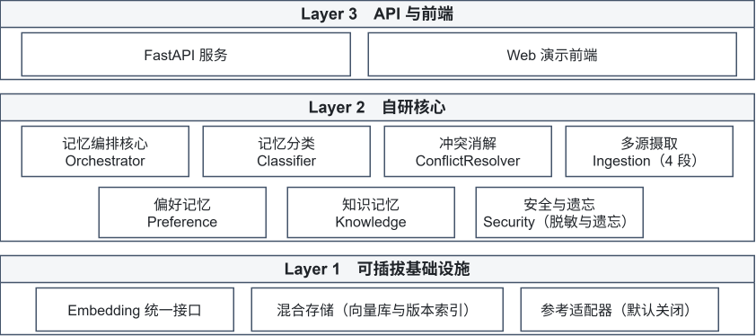

*图 2-1  三层架构*

### 2.2  模块清单

| 模块 | 代码目录 | 核心职责 |
| --- | --- | --- |
| 编排核心 | src/core/ | 流程编排、记忆分类、短/中/长期流转、冲突消解、偏好入库适配 |
| 多源摄取 | src/ingestion/ | 五段式管线：采集、清洗、标准化、质量校验、去重，并写入 staging 中转 |
| 偏好记忆 | src/preference/ | 键空间注册、规则与模型融合抽取、置信度、版本索引、画像生成 |
| 知识记忆 | src/knowledge/ | 记忆库增删改查、字段映射、向量检索、策略评分 |
| 安全与遗忘 | src/security/ | 敏感识别与脱敏、索引加密、自然语言遗忘解析、上下文维护 |
| 向量化 | src/embedding/ | Embedding 统一接口、麒麟 SDK 适配、本地模型与降级后端 |
| 服务接口 | api/ | HTTP 接口层，暴露摄取、召回、遗忘、统计等能力 |
| 演示前端 | frontend/ | 记忆可视化、写入、检索、画像与遗忘交互 |
| 评测 | tests/ & benchmarks/ | 单元测试、指标评测、消融对比与数据集 |

### 2.3  统一记忆分类

偏好与知识最终统一写入记忆库，通过 memory_type 字段区分。五类取值的定义与示例如下，该 Schema 是全模块共享的契约源头：

| memory_type | 含义 | 示例 |
| --- | --- | --- |
| preference | 用户偏好 | 回答用中文、代码要求可直接运行 |
| tool_call | 工具调用经验 | pip 安装超时改用国内镜像 |
| document_chunk | 文档片段 | 验收要求摘要、扫描件 OCR 内容 |
| project_context | 项目上下文 | 知识检索模块位于 src/knowledge/ |
| feedback | 用户反馈 | 刚才只是测试，不要保存 |

附加字段包括 task_type（场景类型）、source（数据来源）、confidence（置信度）、metadata（扩展信息）。**向量化只取 content 字段**，保证嵌入输入与检索语义一一对应。

### 2.4  端到端数据流

一次完整的记忆写入与检索链路如下。注意七个环节**并非单向流水线**：环节 3 的偏好抽取与环节 4 的生命周期晋升是两条并行路径，前者让结构化偏好即时生效，后者保证知识与未结构化文本仍受质量门与热度门约束。

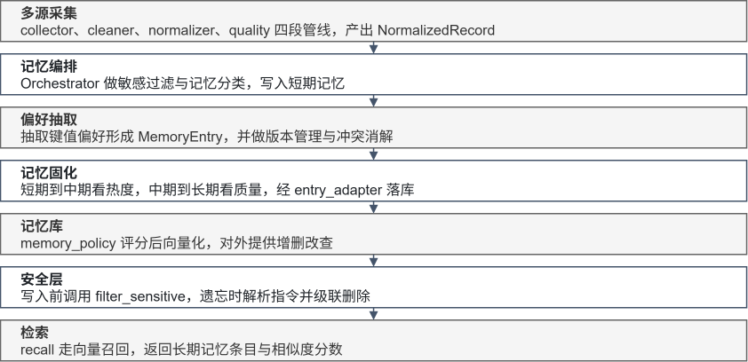

*图 2-4  端到端数据流*

### 2.5  接口契约与协作规则

模块之间只通过接口协作，禁止跨目录直接引用实现类，以保证并行开发与可替换性：

1. 共享契约集中在 `src/common/` 下的接口定义与记忆 Schema，字段变更需双方确认。

2. **最终记忆库只有一个**：向量库承担长期存储；当前开发后端为进程内实现，生产后端为 Milvus，两者共用同一套契约并由对拍脚本校验一致性。

3. 偏好模块**不直接写向量库**：产出结构化 MemoryEntry，交由编排核心统一入库。

4. **向量化统一入口**：所有模块经由 `src/embedding/` 的统一接口获取向量，不各自初始化模型。

5. 安全模块**只负责解析与判定**，正式删除动作由编排核心统一执行，避免多处删除逻辑分叉。

## 第 3 章  多源数据整合

### 3.1  五段式摄取管线

针对赛题要求 (1)，摄取层被拆为五个职责单一的阶段，阶段划分与代码中的 PipelineStage 枚举一一对应。五段式划分的价值在于：每一段的输入输出都是可断言的 JSON，质量门控与去重指纹可以独立做单元测试与消融实验。

| 阶段 | 模块 | 输入 | 输出与职责 |
| --- | --- | --- | --- |
| 采集 | collector | 工具日志、用户行为、手动配置、对话 | 统一封装为待处理记录，保留原始来源标识 |
| 清洗 | cleaner | 原始记录 | 去噪、无效信息过滤、长度限制、标记语言剥离、生成去重指纹 |
| 标准化 | normalizer | 清洗后记录 | 按来源构造稳定正文，输出 NormalizedRecord，只透传白名单 metadata |
| 质量 | quality | 标准化记录 | 置信度与价值评分，决定是否放行入库 |
| 去重 | staging_store | 质量已放行的记录 | 指纹 TTL 原子登记，窗口内重复直接拒绝；只登记已过质量门的记录 |

### 3.2  清洗：从噪声到可用文本

清洗阶段解决的是「数据能不能用」的问题。工具执行结果往往夹杂 ANSI 颜色码、进度条残留、多行重复堆栈；用户行为数据存在大量同质重复；手动配置可能包含注释与模板占位符。清洗模块对上述模式做确定性处理，同时保留可追溯性，所有改写都在 metadata 中留下处理标记，便于回溯到原始内容。

一个容易被忽略的细节是**标记语言与事实的混淆**。用户说「请记住：办公规范 `<b>备份先开</b>` 再改配置」时，其中的标签只是格式标记，并不是事实内容。若不做剥离，抽取模块可能把标签当作语义单元。该场景已被纳入功能覆盖演示集（编号 QC-03）作为专项用例。

### 3.3  标准化：来源专属的稳定表示

标准化阶段为四类来源分别构造正文，使同一语义在不同来源下落到同一表示形式：

| 来源标识 | 典型内容 | 标准化正文构造要点 |
| --- | --- | --- |
| tool_result | 命令执行结果、退出码、耗时 | 保留可复现的命令与关键输出，去除易变字段 |
| user_behavior | 打开应用、重复操作序列 | 聚合为行为模式描述，附带观测次数 |
| manual_config | 设置项、配置文件 | 直接映射为配置键值，置信度最高 |
| conversation | 用户自然语言表达 | 保留原话，附加场景标识 |

> 标准化输出的正文形态直接影响后续向量检索质量与偏好抽取精度。本项目将「正文构造」与「元数据透传」解耦：正文追求语义稳定，元数据仅透传白名单字段，避免脏字段进入向量库。

### 3.4  质量校验：分值与门控

质量模块输出综合质量分，由信息量、结构完整度、来源可信度与置信度加权得到，并设置准入阈值。低于阈值的记录被拒绝并返回可读的拒绝原因，而不是静默丢弃。

| 判定结果 | 典型触发条件 | 系统行为 |
| --- | --- | --- |
| 接受 | 综合质量分达标 | 写入短期记忆并进入后续流转 |
| 拒绝：低质量 | 正文信息量不足、综合质量分低于阈值 | 返回低质量拒绝码与原因列表 |
| 拒绝：重复（去重阶段） | 去重指纹命中 TTL 窗口内的既有记录 | 返回重复标记，不重复入库 |
| 拒绝：载荷非法 | 空文件、不支持的类型、超出大小限制 | 返回非法载荷拒绝码 |

质量门控采用可配置阈值。默认策略对**单次行为**偏保守：一次未弹出确认的删除操作不应被直接记为「用户永久关闭了确认机制」。行为类来源需要累计观测次数（默认 ≥5）方可放行，这是对题目「数据质量参差不齐」的直接工程回应。

### 3.5  中转库：审计、去重与生命周期

摄取层使用 SQLite 作为中转库，承担三件事：审计留痕、TTL 去重、按需导出。

- **审计**：每条经过管线的记录保留处理各阶段的耗时与判定结果，便于定位质量门控误杀。

- **原子去重**：以去重指纹为键做带 TTL 的原子写入，并发场景下不会产生重复记忆。

- **隐私前置**：中转库中的正文、扩展元数据与原始载荷默认先做无状态规则脱敏；原始载荷可整体关闭，明文仅允许开发环境显式开启。

- **生命周期**：手动清理接口默认执行「原始载荷 7 天 / 审计 90 天」的保留期策略；遗忘操作命中目标后同步擦除中转库对应内容，避免删了记忆却留了副本。

> 中转库不替代短期或中期记忆存储。它只解决「数据从哪来、是否可信、是否重复」三个问题，记忆的生命周期管理仍由第 8 章的层管理器负责。

### 3.6  机制创新点：多源清洗与质量门控

| 机制 | 常见做法 | 本项目做法 | 突破点与代价 |
| --- | --- | --- | --- |
| 管线划分 | 单一函数完成清洗与入库 | 采集 / 清洗 / 标准化 / 质量 / 去重五段，每段输入输出均为可断言 JSON | 每段可独立做单测与消融；代价是阶段间需维护中间表示 |
| 正文构造 | 多源数据拼成同一格式 | 按来源分别构造稳定正文，只透传白名单 metadata | 避免脏字段污染向量；代价是新增来源需补构造规则 |
| 去重 | 入库前比较全量文本 | 以去重指纹为键的 TTL 原子写入，并发下不产生重复 | 并发安全；**实测发现跨来源场景粒度偏粗**，见 9.2.4 |
| 质量阈值 | 全库统一阈值 | 按来源类型分别设阈，行为类需累计观测（默认 ≥5） | 单次行为不会被误记为长期习惯；代价是演示需先积累观测 |

质量门控的保守取向需要说明：对单次行为的拒绝不是实现缺陷。题目指出「工具调用执行结果数据质量参差不齐」，若将一次未弹出确认的删除直接记为「用户永久关闭了确认机制」，偏差将直接传递到安全策略。

## 第 4 章  偏好记忆动态捕捉与版本化管理

### 4.1  为什么偏好不能用自由文本表示

以自由文本画像为代表的常见做法，把用户偏好写成一段描述，检索时对整段文字再次嵌入。该做法实现简单，却难以按键精确更新：用户上周声明下载默认目录为 D 盘，本周改口为 E 盘时，系统往往只能追加一句新描述或整段重写，Agent 下一次听从哪一句取决于向量检索命中了哪一段。

一个典型语句可以说明结构约束为什么必要：**「把桌面上所有 .tmp 文件删了，直接删不用问我」**同时携带两层可复用策略：删除前不再确认，执行前也不再给出预览清单。若偏好写成一段小传，两层策略会缠在同一段文字里；此后用户若只修改确认策略，预览策略也会被误伤。因此本模块**先把自然语言收敛为可校验的键值，再进入版本管理与注入**，而不是先生成散文再依赖检索去猜。

### 4.2  封闭偏好键空间

赛题列明的操作习惯、输出风格与安全策略，在实现上扩展为六类键：

| 类别键 | 覆盖内容 | 示例键值 |
| --- | --- | --- |
| habit | 操作习惯 | habit.download_path = "E:/Downloads"；habit.file_organize_rule = "by_type" |
| style | 输出风格 | style.code_runnable = true；style.report_format = "markdown" |
| communication | 交互风格 | communication.explanation_style = "detailed" |
| security | 安全策略 | security.confirm_before_rm = false |
| workflow | 执行流程 | workflow.preview_before_execute = false |
| tool_selection | 工具选择 | tool_selection.data_processing_tool = "python" |

每个键具有布尔、枚举、整数或字符串类型，抽取结果必须通过取值校验：已注册键的类型或枚举取值不符时丢弃该条，不猜测、不截断。**未登记的长尾偏好则不丢弃**：规范化时降级为 `habit.custom_*` 动态键，取值按自由文本处理（上限 512 字符），使「写代码默认用 Go」这类未登记偏好也能结构化落库。两种口径由同一开关控制——评测封闭键准确率时打开 `restrict_llm_to_known_keys`，只保留已注册键；产品默认关闭，保留长尾兜底。模型输出中的别名在入库前规范化，例如把「中文」「py」「word」分别规范为 `zh-CN`、`python`、`docx`。

**封闭键空间带来的关键收益是评测口径可定义**：标注是一组 `preference_key=value`，预测也是一组，做精确交并要求元素相等即可计算 F1，而不必对生成段落做主观打分。这是偏好提取准确率能够稳定评估的前提。

同时，系统**只抽取可复用策略，不把一次性任务记为偏好**。「把这份文件打印出来」应返回空结果，规则匹配同样排除一次性动词。Agent 更常见的错误不是漏记一句习惯，而是把单次任务写成长期规矩，因此评测集中专门设置了负例用于约束该偏差。

### 4.3  规则与大模型融合抽取

抽取层提供三种模式，默认采用融合模式：

| 模式 | 机制 | 适用场景 |
| --- | --- | --- |
| 规则模式 | 确定性模式匹配，不依赖外网 | 离线评测、断网演示、端侧保底 |
| 模型模式 | 调用兼容接口解析为 JSON 数组 | 同义改写、英文泛化 |
| 融合模式（默认） | 优先模型；无密钥、超时或空结果时降级规则；模型有结果时规则仅补充未覆盖的键，不覆盖模型判断 | 生产默认 |

规则覆盖中英文常见表述，包括盘符与路径、表格整理与脚本分析、直接删除、文件搜索、报告语言与格式、按类型整理、压缩与加密、文档转换、批量重命名、文本替换、页面自动化、代码可运行约束以及语气偏好。规则并不追求覆盖全部同义句，而是为端侧提供**不依赖外网的能力下限**。

> 银河麒麟桌面环境不能假设始终可访问云端模型。降级路径不是可选项，而是端侧可行性的必要条件。融合模式在降级时会显式标记降级状态，以免规则成绩被当作融合成绩解读。

偏好抽取所用模型配置与安全过滤所用模型配置**相互独立**，以免语义脱敏任务与抽取任务互相干扰。

### 4.4  可解释置信度

键值抽出之后仍需回答「该条偏好被采信的程度」。本模块不使用黑盒分数，而用来源基础分与一组可手算的调校项合成置信度：

```
confidence = clamp(S_base + B_freq - D_time + B_neg - P_conflict + B_converge, 0, 1)
```

| 来源 | 基础分 | 设定理由 |
| --- | --- | --- |
| 手动配置 | 1.00 | 用户在设置界面给出的值没有意图歧义 |
| 显式陈述 | 0.92 | 自然语言可信，但预留识别误差 |
| 重复行为 | 0.80 | 多次一致观测，具备统计显著性 |
| 单次观察 | 0.55 | 不足以推断长期习惯 |
| 跨场景迁移 | 0.45 | 推断成分较高 |
| 系统默认 | 0.30 | 不反映用户真实意图 |

各项调校规则如下：

- **频率增益**：仅作用于行为类来源，每次额外一致观测 +0.03，上限 +0.15；单次观察累计至三次后来源升级为重复行为。

- **时间衰减**：自上次更新起第 31 天开始每日 -0.005，最多 -0.30；系统默认不参与衰减，否则长期未被改写的出厂策略会不合理地低于用户旧习惯。

- **否定增益**：显式陈述中出现「不用」「不要」「never」等否定模式时 +0.05。「直接删不用问我」的置信度为 0.97，高于由五次沉默行为推出的约 0.86，否定句信息密度更高，通常表示用户在主动覆盖默认行为。

- **冲突惩罚**：同一键出现相悖取值时 -0.15；冲突中含否定语义时 -0.20。

- **一致性增益**：两个独立来源指向同一取值 +0.03，三个独立来源 +0.05；单次观察与重复行为视为同一来源组，不重复加分。

扣分之后比较最高分与次高分，**差距小于 0.15 时暂停自动应用并生成确认提示**。以工具选择冲突为例：用户曾声明数据处理使用表格工具，日常行为却稳定使用脚本语言，施加冲突惩罚后两端分数约 0.77 与 0.71，差距仅 0.06。此时不应静默选边，而应请求用户确认；用户选定后该条按手动配置提升至 0.95。

> 权威入库时的冲突裁决按来源等级与时间进行，**抽取置信度不作为否决条件**。否则用户把下载路径由 D 盘改为 E 盘时，旧值 0.92 会压住新值。在通用记忆中「高置信度不可覆盖」看起来稳健，在偏好改口场景中并不成立。

### 4.5  场景隔离的版本链

题目将「配置版本混乱」与「跨场景数据不一致」并列提出。一种常见处理是把不一致抹平，合成单一全局值。本模块采取相反策略：**同一用户在办公场景用表格工具整理日报、在数据分析场景用脚本处理数据，属于不同任务下的合理习惯，不应在清洗阶段被消灭。**

索引键因此带有范围，读取时场景优先于全局；两种范围下的同一键可同时保持最新：

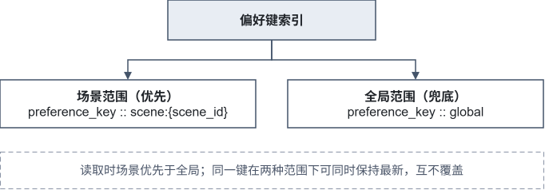

*图 4-1  偏好键的作用域与优先级*

版本更新采用追加新记录的方式，而非原地改写：

| 情形 | 版本号 | 观测计数 | 处理方式 |
| --- | --- | --- | --- |
| 同一键取值未变 | 不变 | +1 | 仅累计观测次数，不产生新版本 |
| 同一键取值变化 | +1 | 清零 | 追加新条目，旧条目 is_latest 置否，并由 supersedes_memory_id 指向被替代记录 |
| 用户回滚 | +1 | 清零 | 追加一条取值为目标历史值的新版本，不改写历史 |

版本号表示**该键被修改的次数**，而不是语句被看见的次数。不在原地改写正文，否则回溯能力会随覆盖一同失去；回滚同样不删除历史版本，审计记录可以回答何时由谁改回了什么。版本字段（version、is_latest、supersedes_memory_id）存放在记录的 metadata 层，不参与索引模型：索引键只由 preference_key 与场景范围决定，因此版本追加不会改变检索入口。

> 实现中发现的一处典型缺陷：写入偏好时使用的场景标识 `general` 与长期化候选使用的 `global` 被判定为不同作用域，导致历史偏好查询命中后又在场景过滤阶段被清空，进而重复新建条目。现已将二者归一化为同一作用域，并补充了回归测试。此类「同一语义两种拼写」的问题在多模块并行开发中尤其值得警惕。

### 4.6  结构化画像与 Agent 注入

抽取与版本解决的是「存储是否清楚」，Agent 个性化还取决于「读取是否稳定」。本模块按当前场景解析后输出键值表、置信度、排序分以及可注入上下文的摘要。写入向量库的正文采用规范形式：

```
[preference] habit.download_path=E:/Downloads | 下载默认放 E 盘
```

取值变化则正文变化，嵌入输入随之更新，避免出现「描述未改、取值已改」而导致向量停留在旧状态的情况。排序分综合置信度、观测次数与近因，端侧可只注入排序靠前的若干条，以控制提示词体积。已失效版本默认不进入检索结果，以免生成过程重新采用被替代的习惯。

相对自由文本画像、整文件覆盖更新、嵌入向量不随取值刷新这三类常见做法，上述设计把偏好从「一段可检索的话」改成**「一组可校验、可版本化、可按场景注入的特征」**。

### 4.7  机制创新点：偏好提取算法

偏好提取算法是赛题评审表「技术创新性」项的首要考察对象。本节把算法的五个关键决策与主流做法逐条对照。

| 决策点 | 常见做法 | 本项目做法 | 突破点与代价 |
| --- | --- | --- | --- |
| 表示形式 | 用户画像写成自由文本，检索时整段嵌入 | 封闭键空间：六类键、四种值类型、别名规范化 | 偏好可按键精确更新与回溯；**代价是开放域自由表达覆盖不全**（见 9.7） |
| 抽取方式 | 纯规则或纯大模型 | 融合抽取：模型负责改写泛化，规则保底；无密钥、超时或空结果时自动降级并**显式标记降级状态** | 端侧断网仍可用；代价是需维护两套抽取规则与融合优先级 |
| 置信度 | 黑盒分数或直接采信 | 来源基础分，配合频率、时间、否定、冲突、一致性五项可手算调校 | 采信依据可人工复核；代价是系数需按场景标定 |
| 冲突裁决 | 高置信度不可覆盖 | 入库裁决按来源等级与时间，**抽取置信度不作为否决条件** | 支持偏好改口（由 D 盘改为 E 盘）；代价是与通用记忆的直觉相反，需在文档中声明 |
| 版本与场景 | 全局单值，跨场景差异被抹平 | 场景隔离版本链，追加式更新，supersedes 指针，回滚也是追加 | 跨场景习惯共存且历史可回溯；代价是索引键数量随场景数线性增长 |
| 一次性任务 | 只要含偏好动词就抽取 | 只抽可复用策略；规则同样排除一次性动词，并设负例约束 | 减少「单次任务被写成长期规矩」类错误；实测负例误抽为 0 |

其中「封闭键空间、融合抽取、可手算置信度」三者的组合是相对常见做法的核心差异。它把偏好从「一段可检索的话」变成**「一组可校验、可版本化、可按场景注入的特征」**，使准确率变成可定义、可复现的指标，而不是对生成段落的主观打分。

> 范围说明：封闭键空间在开放域自由表达上覆盖有限。实测中开放域偏好抽测只有20% 样本正确率；两项数字口径不同，详见 9.7 节，不可互相替代。

## 第 5 章  知识记忆结构化整合与检索

### 5.1  统一记忆 Schema 与字段映射

知识记忆与偏好记忆共用同一套存储契约，通过 memory_type 区分。完整入库链路涉及三次字段映射，任何一次错位都会导致过滤失效或检索丢失字段。下图中的折叠环节尤其容易出错：存储行在返回时会把 19 个列重新塞回 metadata，使调用方看到的键集合与写入时并不一致。

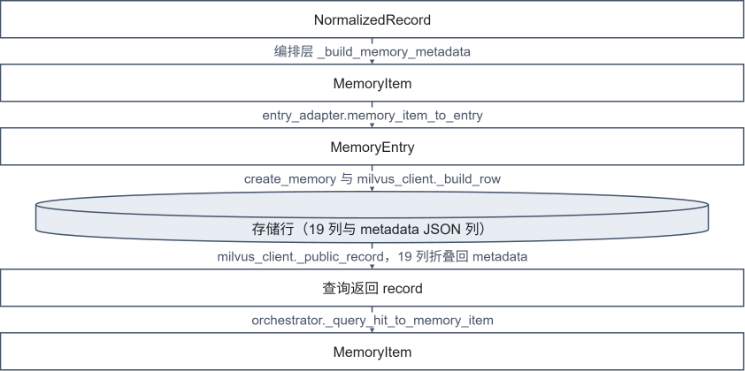

*图 5-1  三层字段映射链路*

关键字段的映射规则如下：

| MemoryEntry 字段 | 存储列 | 类型 | 备注 |
| --- | --- | --- | --- |
| content | content | VARCHAR(4096) | 唯一向量化输入，超长静默截断 |
| user_id | user_id | VARCHAR(128) | 用户隔离依据 |
| memory_type | memory_type | VARCHAR(64) | 五类枚举值 |
| task_type | task_type | VARCHAR(64) | 按场景提示推断 |
| scene_id | scene_id | VARCHAR(128) | 场景隔离依据 |
| confidence | confidence | FLOAT | 存在精度损失，评测时需注意 |
| metadata.version | version | INT64 | 版本链序号 |
| metadata.is_latest | is_latest | BOOL | 当前有效版本标记 |
| metadata.preference_key | preference_key | VARCHAR(128) | 可过滤字段 |
| metadata.preference_value | preference_value | VARCHAR(512) | **不可过滤**，见下方说明 |
| metadata.supersedes_memory_id | supersedes_memory_id | VARCHAR(128) | 版本链指针 |

> 过滤白名单机制说明：为控制检索表达式复杂度，存储层只允许在白名单字段上过滤，非白名单键会被**静默忽略而不报错**。这意味着调用方无感知地拿到全量结果。专项核对覆盖了该行为，并把 `preference_value` 过滤、空表达式退化为不过滤两类临界情况固定为断言，避免后续维护者误以为是实现缺陷而随意修改语义。

### 5.2  新旧知识冲突消解

知识记忆的冲突与偏好不同：知识冲突往往表现为同一事实的两个版本并存，需要判断哪一条更可信，而不是简单按时间覆盖。冲突消解器的裁决依据包括：

- **来源等级**：手动配置高于显式陈述，显式陈述高于行为推断，行为推断高于系统默认。

- **时间近因**：对陈旧记忆施加轻微降权，使新事实能够覆盖漂移的旧结论。知识路径可覆盖来源等级：事实取「最新」，即使用户刚说出的新事实来源等级低于旧的手动配置。

- **低信任护栏**：行为推断与工具结果类低信任观测不得覆盖更高信任的既有事实，避免噪声埋点改写权威知识。

> 范围说明：冲突消解器**未实现语义一致性维度**。枚举中预留的合并动作目前不会被产出，裁决全部由来源等级、时间近因与低信任护栏三项确定性规则给出，可逐条复算。「互补事实合并」由 8.2 节表 8-1 与 8.3 节的语义聚类合并承担（向量余弦与关键词 Jaccard 加权），实体级的知识合并仍属待扩展项。该取舍是刻意的：在本项目的数据规模上，确定性规则的可解释性优先于依赖语义相似度的自动合并。

裁决结果以追加方式落库，被替代条目标记 supersedes 关系并退出当前有效集合，保留完整历史以便回溯。项目为该机制设置了消融对照实验（见 9.5 节），以「无冲突消解基线」作为对照，验证机制本身的增量价值。

### 5.3  关联检索与 RAG

检索路径以向量召回为主，结构化过滤为辅：

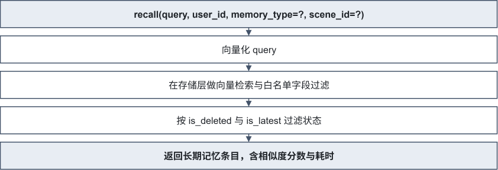

*图 5-2  关联检索路径*

三处工程细节直接影响检索质量与用户体验：

1. **默认只返回当前有效版本**。未过滤的召回会夹带已被替代的旧偏好，导致 Agent 采用过期习惯。评测与集成时建议显式限定 memory_type。

2. **检索不查询短期记忆**。短期层承载会话候选，长期层才是权威来源，两者混检会让检索结果随会话状态漂移。

3. **检索策略可观测**。返回体包含 strategy 与 latency_ms 字段，既能支撑延迟指标评测，也便于定位「命中为空但未报错」类问题。

### 5.4  记忆策略评分

写入前由记忆策略模块计算保存分数，决定条目是否具备长期价值。该分数与质量分共同构成准入与晋升的双重门控，避免低价值条目占用长期存储与检索预算。

### 5.5  机制创新点：冲突处理与关联检索

赛题评审表要求论证知识冲突处理机制与关联检索策略是否突破现有技术瓶颈。下表以「同类方案的常见做法」为参照物，逐条列出差异与相应代价。只列收益不列代价的对照在评审中并不成立。

| 机制 | 常见做法 | 本项目做法 | 突破点与代价 |
| --- | --- | --- | --- |
| 新旧知识冲突 | 按写入时间覆盖，后写胜出 | 来源等级与时间近因的多维裁决，叠加低信任观测护栏；被替代条目保留 supersedes 指针（见 5.2） | 避免「沉默覆盖」导致历史不可回溯；代价是需维护版本链与额外裁决计算 |
| 事实歧义 | 同一主题直接取最后一条 | 冲突消解取最新事实并加低信任护栏；互补事实的并合下沉到中期层，按语义余弦与关键词 Jaccard 加权判定（见 8.2、8.3） | 低信任埋点不会改写权威知识；代价是实体级合并尚未实现，当前仍有 4 项知识检索用例未通过（见 9.3.2） |
| 检索过滤 | 仅按用户过滤，其余条件在应用层筛 | 结构化条件下推到存储层，白名单字段参与检索表达式 | 减少无效候选与序列化开销；代价是白名单外字段会被静默忽略，需以文档与断言约束 |
| 结果有效性 | 返回全部命中，由上层自行判断新旧 | 默认只返回当前有效版本，按 is_deleted / is_latest 双重过滤 | 避免 Agent 采用被替代的过期事实；代价是历史查询需显式关闭过滤 |
| 检索可观测 | 仅返回结果列表 | 返回 strategy 与 latency_ms，区分向量检索与词面补召路径 | 使延迟指标可归因；实测发现词面补召会把 P95 从 386ms 抬到 1005ms，已通过英文问句默认走语义排序修复至 478.9ms（见 9.3.3） |

其中「多维冲突裁决与追加式版本链」和「结构化条件下推到存储层」是相对常见做法的两个主要差异点。二者的收益已在消融对照中量化：冲突裁决相对「总是替换」基线的正确率有明确提升，且端到端延迟仍在指标范围内。

## 第 6 章  端侧轻量化部署与麒麟适配

### 6.1  Embedding 统一接口

向量化是记忆系统的性能瓶颈与部署风险点。项目将其收敛为单一入口，所有模块经由工厂获取后端，不各自初始化模型：

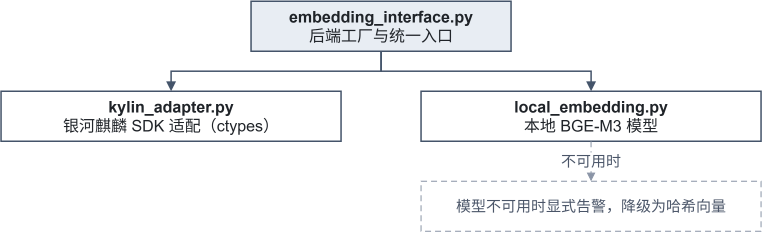

*图 6-1  Embedding 统一接口与降级路径*

该设计的直接收益是**部署形态可切换而业务代码零改动**：开发机使用本地模型，真机切换到麒麟 SDK，两者共用同一接口。降级路径始终显式告警，不会静默产生质量不可控的向量。

### 6.2  银河麒麟 SDK 适配

麒麟端侧向量化通过系统提供的 Embedding 动态库接入，由适配层完成库加载、维度协商、异常转换与生命周期管理。适配层同时提供向量检索桥接，通过本地 socket 接入系统向量引擎。

| 适配项 | 处理方式 |
| --- | --- |
| 动态库加载 | 经环境变量显式指定系统库路径，避免误加载替代实现 |
| 维度协商 | 与业务侧约定的向量维度对齐，运行时校验不一致即失败 |
| 严格模式 | 验收模式禁止回退到本地或哈希后端，确保测的是真实 SDK |
| 异常转换 | 系统调用错误转换为统一的业务异常，不向上抛出裸错误码 |
| 检索桥接 | 通过 C++ 桥接库连接系统向量服务，支持集合与过滤条件透传 |

### 6.3  延迟控制与轻量化

检索响应时间 ≤500ms 属于端到端指标，项目从四个层面控制：

- **向量化复用**：同一会话内相同文本不重复计算向量。

- **结果集裁剪**：默认返回条数受控，避免大结果集序列化开销。

- **过滤前置**：把用户、类型、场景等结构化条件下推到存储层，减少无效候选。

- **降级可观测**：任一后端降级都会在健康检查中体现，避免把降级路径的性能误当作真实端侧性能。

### 6.4  端侧部署形态对照

同一套代码支持三种运行形态，差异只在适配层与配置，业务逻辑完全一致：

*表 6-1  三种运行形态的对照*

| 形态 | 向量化后端 | 向量存储 | 适用场景 | 成绩口径 |
| --- | --- | --- | --- | --- |
| 开发机形态 | 本地 BGE-M3 | 进程内实现 | 功能开发、单元测试 | 不计入端侧指标 |
| 端侧真机形态 | 银河麒麟系统 Embedding SDK | 系统向量服务 | 正式验收、现场演示 | 作为端侧成绩 |
| 降级形态 | 本地模型或哈希后端 | 当前可用后端 | 端侧断网、密钥缺失 | 显式标记降级，不按端侧成绩解读 |

形态切换只需调整环境变量与配置文件，不修改业务代码；健康检查接口会直接暴露当前形态与是否降级，避免成绩口径混淆。

### 6.5  机制创新点：端侧轻量化适配

| 机制 | 常见做法 | 本项目做法 | 突破点与代价 |
| --- | --- | --- | --- |
| 后端接入 | 各模块自行初始化模型 | 统一工厂入口，业务代码不感知具体后端 | 开发机与真机切换零代码改动；代价是多一层间接 |
| 降级策略 | 模型不可用时静默回退 | 降级必显式告警，健康检查可观测降级状态 | 避免将降级路径的性能误认为真实端侧性能 |
| 验收严格性 | 用可用后端跑通即可 | 验收模式强制系统 SDK，显式配置替代后端直接失败 | 保证「测的是真实端侧能力」；代价是验收环境需完整准备 |
| 延迟预算 | 只报算法耗时 | 以端到端 HTTP 延迟为口径，组件级耗时不作为官方成绩 | 指标不失真；代价是需区分两类数字并分别标注 |

真机实测结果：麒麟系统 SDK 真实调用、无降级，输出 768 维向量，相关与无关文本的相似度分别为 0.859 与 0.389，区分度明确；单次向量化 20 次采样延迟最小 12.0ms、中位 18.9ms、最大 35.0ms。

## 第 7 章  敏感信息过滤与自然语言精准遗忘

### 7.1  设计目标：隐私与记忆分离

安全模块在数据与模型交互的边界上提供三层能力：敏感信息识别与脱敏、自然语言驱动的精准遗忘、上下文窗口维护。核心设计理念是**「隐私与记忆的分离」**：记忆库只存不可逆占位符，真实敏感原文仅保存在本地加密索引中。

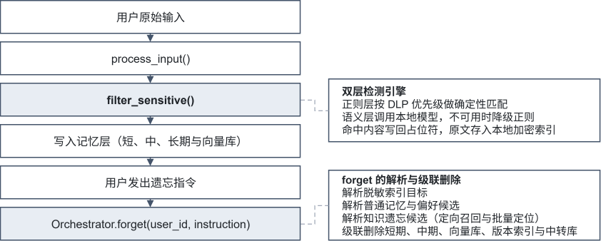

*图 7-1  脱敏与自然语言遗忘数据流*

### 7.2  双层检测引擎

`filter_sensitive(text, user_id)` 返回脱敏后文本、检测类型列表与占位符映射表。

#### 7.2.1  正则层

内置规则集覆盖 50 余种敏感类型，按数据防泄漏优先级排序：**密钥凭证 > 证件 > 金融 > 通讯 > 网络 > 其他**，先匹配更具体的模式，后匹配更通用的模式，以降低误伤率。

| 类别 | 代表规则 |
| --- | --- |
| 密钥凭证 | SSH 私钥、X.509 证书、JWT、Bearer Token、云平台访问密钥、代码托管平台令牌、支付平台密钥、数据库连接串、环境变量凭据 |
| 证件 | 身份证、护照、港澳通行证、统一社会信用代码、外国人永居证、驾驶证 |
| 金融 | 银行卡号、卡验证码、银行卡有效期 |
| 通讯 | 手机号（含国际前缀与分隔符）、固定电话、短信验证码、邮箱 |
| 网络身份 | IPv4、MAC 地址、IMEI、会话标识、社交账号、加密钱包地址 |
| 其他 | 出生日期、车牌、快递单号、工号、合同号、密保答案、登机牌 |

规则以声明式结构定义，支持通过配置文件追加自定义规则，便于适配特定行业的敏感模式。

#### 7.2.2  语义层

正则层难以覆盖隐式敏感信息（如工号、昵称、隐含地址）。语义层调用本地模型识别此类内容，并在模型不可用、超时或返回异常时**降级返回空列表**，由正则层兜底，绝不抛出异常中断主流程。

> 防误脱敏设计：执行每条规则前，先用哨兵符把已有占位符保护起来，避免数字类规则把占位符内的十六进制数字段二次识别为敏感内容。该问题在早期版本中真实出现过，现已通过哨兵机制与回归测试固定。

### 7.3  哈希占位符与索引加密

每条命中的敏感内容生成唯一不可逆占位符：

```
placeholder = '<HASH_' + SHA256(原文 + 类型 + 随机盐)[:8] + '>'
示例：<HASH_7f3a9b>
```

占位符不可逆，记忆库中只保留占位符，模型无法从占位符还原真实隐私。索引维护占位符到敏感条目的双向映射，并提供软删除、统计与按用户隔离的持久化能力。

| 索引条目字段 | 说明 |
| --- | --- |
| placeholder_id | 形如 <HASH_7f3a9b> 的占位符 |
| original_content | 原始敏感内容（落盘时加密） |
| sensitive_type | 敏感类型标识 |
| user_id | 所属用户，用于隔离 |
| created_at | 创建时间 |
| is_deleted | 软删除标记 |

**索引加密**采用 AES-256-GCM，仅加密敏感原文，占位符与类型保持明文以保证查询性能：

- 密文格式带版本前缀，支持**明文索引兼容加载**，升级过程不需要停机迁移。

- 密钥优先来自环境变量，兜底使用本地密钥文件（首次自动生成，非 Windows 平台限制为仅属主可读）；文件不可写时退化为进程内随机密钥。

- 密钥变更或数据损坏导致解密失败时降级为空串，**加载过程不中断**。

- 专项测试覆盖：落盘无明文、往返还原一致、明文索引兼容、密钥变更降级、密钥文件权限。

此外提供受控的**还原能力**，用于需要回显真实内容的场景。还原按占位符长度降序替换，避免短占位符被部分匹配；仅依赖本地索引文件，无索引则无法还原，保证还原能力本身不成为新的泄露面。

### 7.4  自然语言精准遗忘

遗忘是赛题要求 (5) 的核心能力。系统需要从一条自然语言指令出发，定位并删除四类不同性质的目标：

| 目标类型 | 示例指令 | 定位方式 | 删除方式 |
| --- | --- | --- | --- |
| 脱敏索引 | 忘记我的手机号 | 扫描脱敏索引，匹配类型与原文语义 | 索引软删除，并清理对应密钥条目 |
| 普通记忆 / 偏好 | 忘掉关于下载目录的偏好 | 扫描普通记忆与偏好候选，按语义相似度评分 | 向量库软删除，并同步清理版本索引 |
| 知识记忆（定向） | 忘掉 pip 镜像相关知识 | 抽取主题做定向召回，取候选交集 | 候选级联删除 |
| 知识记忆（批量） | 删除全部某类知识 | 按结构化过滤条件构造删除计划 | 按条件批量软删除，覆盖召回条数之外的全量条目 |

四个工程要点：

1. **相似度门控**：候选命中需超过最低相似度阈值（默认 0.6）才纳入删除范围，避免「忘掉不存在的某某记忆」这类指令误删无关条目。

2. **空指令安全**：空指令返回零删除，不做通配匹配。

3. **版本索引同步**：偏好删除后同步清理本地版本索引，否则界面会继续展示已遗忘条目。

4. **中转库同步擦除**：目标定位成功后同步擦除中转库中的正文、元数据、原始载荷与去重指纹，避免删除不彻底。

### 7.5  上下文维护

长期交互中上下文窗口会持续逼近上限。上下文维护模块在触发阈值前主动压缩与重构历史对话，保留任务关键状态与近期交互，降低早期冗余内容占比，使长会话不触顶且语义连贯。

### 7.6  机制创新点：隐私分离与精准遗忘

| 机制 | 常见做法 | 本项目做法 | 突破点与代价 |
| --- | --- | --- | --- |
| 存储形态 | 敏感信息与普通记忆同库存储 | 不可逆哈希占位入库，原文存本地加密索引 | 记忆库泄露不等于隐私泄露；代价是还原需依赖本地索引 |
| 索引保护 | 索引明文落盘 | AES-256-GCM 仅加密原文，带版本前缀，支持明文索引平滑升级 | 兼容旧数据不需停机迁移；代价是密钥丢失后无法还原 |
| 检测引擎 | 单一正则或单一模型 | 正则（50 余种规则，按 DLP 优先级排序）与可选语义模型，后者失败时降级不中断 | 兼顾确定性与召回；代价是双层需防重复命中 |
| 遗忘粒度 | 按标识删除单条记忆 | 自然语言驱动，覆盖脱敏索引、普通记忆与偏好、知识定向、知识批量四类目标 | 用户可用自然语言表达删除意图；代价是需相似度门控防误删 |
| 删除彻底性 | 只删主存储 | 级联清理短期 / 中期 / 向量库 / 版本索引 / 摄取中转库 | 避免「删了记忆却留了副本」；代价是删除链路变长，需事务性保障 |

> 实现层的一处细节：执行每条正则前先用哨兵符保护已有占位符，否则数字类规则会把 `<HASH_7f3a9b>` 里的十六进制段二次识别为敏感内容。该问题在早期版本中真实出现过，现已以哨兵机制与回归测试固定。

## 第 8 章  记忆流转机制

### 8.1  三层记忆与门控条件

记忆按生命周期分为三层，层间通过热度与质量分双门控推进。三者不是三个平行的存储，而是**同一份内容在不同成熟度阶段的三个位置**：短期是候选层，中期是聚合层，长期是权威层。

| 层级 | 承载内容 | 晋升条件 | 容量约束 |
| --- | --- | --- | --- |
| 短期 | 原始交互、工具执行结果 | 会话结束或容量满时进入晋升候选 | 按用户会话隔离 |
| 中期 | 聚合后的片段 | 热度 ≥ 阈值 | 定容池，按有效热度淘汰 |
| 长期-偏好 | 习惯、风格、安全策略 | 质量分达标且分类为 preference | 无硬上限，按版本链管理 |
| 长期-知识 | 流程、案例、模板 | 质量分达标且分类为 knowledge | 无硬上限，按冲突消解管理 |

### 8.2  与短期记忆、中期记忆的交互逻辑

赛题要求方案明确兼容记忆流转机制，并说明与短期记忆、中期记忆的交互逻辑。本项目把交互拆为写入、晋升、读取、更新、遗忘、容量六个动作，各自的归属层十分明确：

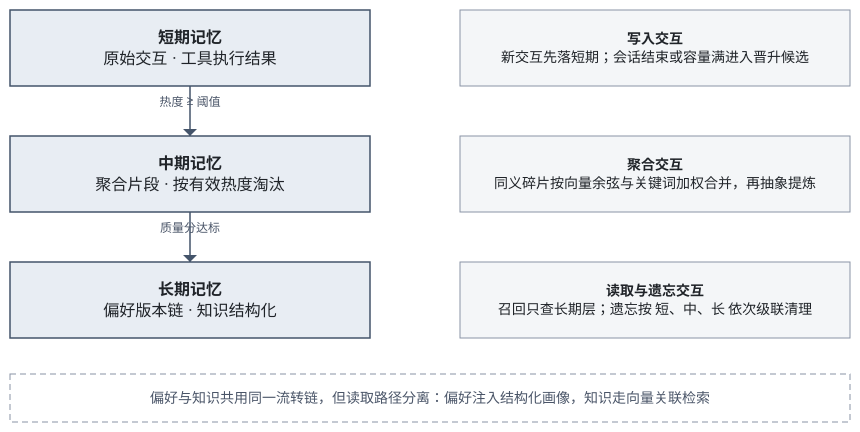

*图 8-1  记忆流转与短/中期交互逻辑*

*表 8-1  三个记忆层的交互职责划分*

| 交互动作 | 短期记忆 | 中期记忆 | 长期记忆 |
| --- | --- | --- | --- |
| 写入 | 每条通过质量门与敏感过滤的输入立即落短期 | 不直接写入 | 仅由长期化流程写入，不接受直接写入 |
| 晋升 | 会话结束或容量满时进入晋升候选 | 接收热度达标的短期条目 | 接收质量分达标且分类明确的中期条目 |
| 读取 | **不参与召回** | **不参与召回** | 召回的唯一条目 |
| 更新 | 不做版本管理，按会话覆盖 | 同义碎片按向量余弦与关键词加权合并，不保留版本 | 追加式版本链，旧版本 is_latest 置否并由 supersedes 指针关联 |
| 遗忘 | 级联删除命中条目 | 级联删除命中条目 | 软删除，并同步清理版本索引与中转库 |
| 容量 | 按用户会话隔离 | 定容池，按有效热度淘汰 | 无硬上限 |

该划分背后有三条设计理由：

1. **召回只读长期层**。若短期也参与召回，检索结果会随当前会话的内容漂移，同一问题在不同时间得到不同答案，这是记忆系统最难排查的一类缺陷。

2. **中期只做聚合，不承担权威职责**。中期层的能力是同义合并与热度淘汰，目的是在申长期之前先把重复与陈旧内容压下去，减少长期层的碎片。它不保证内容一定正确，因此不能作为回答依据。

3. **偏好存在并行快捷路径，知识没有**。结构化偏好经抽取后可直接进入长期层并即时生效，因为个性化服务依赖它立刻可用；而知识与未结构化文本必须依次通过热度门与质量门，以免将低价值噪声沉淀为长期记忆。这条差异是**有意设计而非实现遗漏**，在 8.4 节的一致性约束中再次声明。

### 8.3  热度模型与长期化

短期到中期的晋升由热度驱动。单项热度由访问次数、质量分与置信度合成：

```
heat = access_count + quality_score × 5 + confidence
```

该公式的一个实际影响是：工具执行结果类条目的初始热度约为 4.7，在热度阈值为 5.0 时**距离晋升仅差一次访问**。若不显式触发访问计数，知识类记忆会长期停留在短期层而无法进入检索范围。工程上通过检索接口的访问计数与显式触达接口解决，并在验收脚本中固定了「先触达再长期化」的标准流程。

中期转入长期时有两项语义增强：

- **语义聚类合并**：晋升批次先做语义聚类，把跨对话中的同义表述合并，避免同一习惯因表述差异产生多条长期条目。合并判据由字符相似度升级为**向量余弦相似度与关键词 Jaccard 的加权组合**，使跨对话同义改写可以被正确去重。

- **抽象提炼**：对中期碎片做抽象提炼后再写入长期层，使跨对话合并后的稳定陈述被提炼而非原样搬运。该能力可选用本地模型增强，默认关闭以避免每次长期化都调用模型。

> 抽象结果的可靠性需要护栏。实测发现本地小模型在该任务上输出偶发不稳定（提示词回显或偏离主题），因此系统将抽象文本写入单独的摘要元数据字段，**规范正文仍保留合并后的最新用户原话**，并增加启发式护栏：疑似回显时退回原内容，避免污染长期记忆。这是一条重要的工程经验：用模型增强时，必须让模型输出处于可验证的位置，而不是直接改写权威字段。

### 8.4  热度衰减与一致性

中期池的淘汰策略由先进先出改为**按有效热度淘汰**。有效热度在基础热度上引入近因衰减：

```
effective_heat = heat × exp(-Δt / τ)
```

其中 Δt 为距最近访问的时间，τ 为可配置的衰减时间常数。该设计使「曾经热门但已长期未用」的碎片优先让位于近期高频内容，更贴近真实使用模式。

记忆流转中还有三处一致性约束：

1. **偏好生效不绕过门控**：并行抽取路径产生的结构化偏好可即时生效，但知识类与未结构化文本仍须经过短、中、长期筛选，避免为演示效果跳过质量门与热度门。

2. **持久化身份对齐**：本地记忆标识与持久化后的全局标识分字段保留，互不覆盖，遗忘时两者均可命中。

3. **已晋升内容不重复长期化**：晋升后原层的条目状态被正确标记，避免同一内容在多轮长期化中产生副本。

### 8.5  机制创新点：记忆流转与长期化

| 机制 | 常见做法 | 本项目做法 | 突破点与代价 |
| --- | --- | --- | --- |
| 中期合并 | 按字符相似度去重 | 向量余弦相似度与关键词 Jaccard 的加权组合 | 跨对话同义改写可被正确合并；代价是每次合并需算向量 |
| 中期淘汰 | 先进先出 | 有效热度 = 基础热度 × 近因衰减，按有效热度淘汰 | 近期高频内容优先于陈旧热门内容；代价是需维护衰减时间常数 |
| 长期化 | 直接搬运中期碎片 | 先语义聚类再抽象提炼，抽象结果写入独立摘要字段 | 减少长期层碎片；代价是多一次模型调用（默认关闭） |
| 模型护栏 | 模型输出直接改写正文 | 摘要与规范正文分离，疑似回显时退回原内容 | 避免小模型不稳定输出污染权威字段 |
| 晋升路径 | 所有内容同一条晋升链 | 结构化偏好可即时生效；知识与未结构化文本必须走完整链 | 个性化立即可用且知识不被噪声污染；代价是需向评审解释两条路径的合理性 |

## 第 9 章  量化评测与效果验证

### 9.1  评测体系与阶段划分

本项目的评测分为两个阶段，对应研发过程的前后两段，两阶段的**数据集性质与指标口径完全不同，因此分开陈述、互不混算**。这种划分方式本身也是对评审的如实说明：前期验证「功能是否跑通」，后期验证「公开数据集上的指标水平」。

| 阶段 | 数据集性质 | 回答的问题 | 指标口径 |
| --- | --- | --- | --- |
| 项目前期 | 自建功能覆盖演示集（80 案例） | 赛题 7 项要求是否端到端跑通、异常分支是否被正确处理 | 按案例计数的判定通过率（PASS / FAIL / MANUAL） |
| 项目后期 | 发榜单位推荐的可参考公开开源数据集（十库抽样） | 在同源异构的真实语料上，四项硬指标处于什么水平 | Hit@5 / Recall@5 / 准确率 / P95 延迟 |

除上述两阶段外，还包含**真机验收**（银河麒麟 V11 上按赛题要求实跑）与**消融对照实验**（验证各机制相对基线的增量）两个专项，见 9.5 与 9.6 节。

### 9.2  项目前期：自制功能覆盖演示集

阶段目标是验证赛题 7 项要求在主链路上是否真实可用，并**故意覆盖异常与拒绝分支**。只测正常路径的覆盖集无法暴露质量问题。

#### 9.2.1  数据集构成

| 功能域 | 案例数 | 覆盖内容 |
| --- | --- | --- |
| 多源接入 | 8 | 四类数据源写入、空载荷 / 不支持类型 / 超限载荷的拒绝、统计一致性 |
| 文档与图片 | 10 | PDF 与文档摄取、扫描件 OCR、去重、非法与超限文件拒绝 |
| 清洗与质量控制 | 8 | 标记语言剥离、低质量拒收、去重指纹、一次性行为拒绝 |
| 偏好提取与更新 | 12 | 显式偏好抽取、版本更新、跨场景共存、负例不编造、自然语言遗忘 |
| 知识检索 | 12 | 事实类问答、无关问句应返回空、多文档主题消歧 |
| 冲突处理 | 8 | 同一事实多版本、端口与项目归属区分、重复写入抑制 |
| 敏感信息与遗忘 | 10 | 手机号脱敏、脱敏后不进偏好、遗忘后不回潮、空指令安全 |
| 用户与场景隔离 | 6 | 多用户并行写入与检索互不串扰、文档隔离 |
| 记忆流转与持久化 | 6 | 短期到长期晋升、长期化、进程重启后仍可召回 |

#### 9.2.2  总览与分功能结果

本轮（2026-09-12）在真机宿主环境执行，API 使用麒麟向量后端（`memory_backend=kylin`、`embedding_backend=kylin`、`kylin_strict=1`、768 维）。

| 指标 | 数值 |
| --- | --- |
| 总案例 | 80 |
| 自动判定通过 | **65** |
| 自动判定失败 | 12 |
| 需人工补测 | 3（进程重启类，独立脚本已全部补测为通过） |
| 自动判定通过率（不含人工项） | 65 / 77 ≈ **84.4%** |
| 错误（脚本异常） | 0 |

*表 9-1  前期功能覆盖演示集分功能结果*

| 功能域 | 案例数 | 通过 | 未通过 | 结论 |
| --- | --- | --- | --- | --- |
| 多源接入 | 8 | 8 | 0 | 正常 |
| 文档与图片 | 10 | 8 | 2 | 图片与拒绝项正常；2 项召回为空 |
| 清洗与质量控制 | 8 | **8** | 0 | 标记语言剥离用例已通过 |
| 偏好提取与更新 | 12 | **12** | 0 | 短风格句已通过质量门 |
| 知识检索 | 12 | 5 | 7 | 无关问句已返回空；英文文档中文问句常为空 |
| 冲突处理 | 8 | 5 | 3 | 去重正常；端口与双项目区分仍弱 |
| 敏感信息与遗忘 | 10 | 10 | 0 | 正常 |
| 用户与场景隔离 | 6 | 6 | 0 | 正常 |
| 记忆流转与持久化 | 6 | 3 | 0 | 3 项人工项经独立补测后全通过 |

相对上一轮（2026-09-10，70 通过 / 7 未通过），本轮三处实质性改进：标记语言剥离用例由失败转为通过；短句风格偏好由被质量门拒绝转为接受；无关问句由返回近邻端口改为返回空结果。同时知识检索的失败数上升，原因是词面过滤收紧，**中文问句检索英文办公文档**被过滤为空。

> 通过率下降不等于功能回退。词面过滤收紧同时修好了「无关问句乱答」，代价是「跨语言问句被过滤为空」，两者是同一策略的一体两面。

#### 9.2.3  赛题必做案例

| 编号 | 验证内容 | 结果 |
| --- | --- | --- |
| PREF-07 | 自然语言遗忘偏好后，同用户其他偏好需保留 | **通过** |
| PREF-08 | 询问不存在的偏好时不得编造 | **通过**（未新建偏好、未入库） |
| KNOW-06 | 知识检索返回主结论且不夹带无关偏好 | **通过** |
| SEC-04 | 遗忘后目标偏好不得回潮 | **通过** |

#### 9.2.4  未通过项定位

12 项未通过案例完整保留，作为后续迭代输入，并给出如下性质定位：

| 类别 | 现象 | 性质定位 |
| --- | --- | --- |
| 召回为空 | 部分文档去重后召回条数为 0；中文问句检索英文文档被词面过滤清空 | 词面过滤阈值与跨语言场景不适配 |
| 排序区分度 | 应命中特定事实时顶到了配置路径偏好 | 向量召回排序区分度不足 |
| 事实归属 | 同源文档片段的主题归属未消歧，返回了邻近主题内容 | 缺少主题归属判定 |
| 冲突裁决 | 相关端口与项目归属不能按项目拆开 | 冲突裁决的过滤顺序问题 |

该分布说明：**偏好、安全、清洗、隔离四类模块已相对稳定，知识检索的排序与冲突裁决是当前主要迭代方向**。这一判断在后期公开数据集抽测中得到印证：BPMN 任务名检索已通过，而知识检索排序仍需继续优化。

### 9.3  项目后期：公开开源数据集抽样验证

阶段目标是回答「在同源异构的真实语料上，四项硬指标处于什么水平」。语料取自发榜单位推荐的可参考公开数据集，覆盖对话、工具调用、用户画像、业务流程文档、开放域检索与长对话记忆六类形态。

#### 9.3.1  数据集清单

抽样参数：seed = 42；对话 / 行为 / 文档类各 100 条；检索类 98 个有效问句配 2000 个候选段落。运行环境为银河麒麟 Embedding，768 维，`memory=memory`，strict = 1。**对话、行为、文档类取自 2026-09-13 ~ 09-14 轮（基线**`72f770b`**）；四项硬指标已更新至 2026-09-15 轮（基线**`17af2b3`**，n = 150，证据见附录 B）。**沿用不同轮次的数字时随数字标明轮次，不横比。

*表 9-2  后期公开数据集抽样结果*

| 数据集 | 形态 | n | 编排接受率 | 主指标 | P95 延迟 |
| --- | --- | --- | --- | --- | --- |
| MultiWOZ 2.2 | 任务型对话 | 100 | 1.00 | 自检索 Hit@5 = **0.92** | 53.4ms |
| ToolBench | 工具调用轨迹 | 100 | 0.96 | 自检索 Hit@5 = **1.00** | 45.0ms |
| PersonaChat（人设句） | 用户画像 | 100 | 0.99 | 自检索 Hit@5 = **1.00** | 42.1ms |
| PersonaChat（整段拼接） | 用户画像 | 100 | 1.00 | 人设问 Hit@5 = **0.97** | — |
| BPMN（任务名） | 业务流程文档 | 100 | 1.00 | 自检索 Hit@5 = **0.88** | 36.1ms |
| BPMN（原始 XML） | 业务流程文档 | 100 | 1.00 | 自检索 Hit@5 = 0.42 | — |
| DailyDialog | 日常对话 | 100 | 1.00 | 自检索 Hit@5 = **1.00** | 77.2ms |
| DIALOGBENCH | 知识对话 | 100 | 1.00 | 自检索 Hit@5 = **1.00** | 66.8ms |
| MS MARCO v1.1 | 开放域段落检索 | 150 问（147 有效）/ 2000 段 | — | Recall@5 = **0.8707** | 108.6ms |
| TREC DL 2019/2020 | 开放域检索（pid 子库） | 97 问 / 7707 段 | — | 分级 nDCG@10 = 0.7295 | **478.9ms** |
| LongMemEval（更新子集） | 长对话记忆冲突 | 142 对 | — | 冲突解析正确率 = **1.00** | 64.5ms |
| user-preference-564k | 开放域偏好 | 150 | — | 语义口径 **0.9** / 词面口径 0.6867 | — |
| 自建封闭键评测集 | 结构化偏好 | 35 | — | 精确匹配 = **0.9429** | — |

> 口径声明：上表 Hit@5 均为**精确记忆标识自检索**，不是官方 BLEU / inform / nDCG 等原生指标。TREC 一行是在「各问正例互为干扰」的 7707 段子库上做的进程内排序，**不是官方 8.8M 全库排名**，因此其数字与其它行不可横向比较。

#### 9.3.2  知识检索召回率

赛题要求 ≥85%。以开放域段落检索口径作为对外口径：

| 口径 | 样本 | 结果 | 是否达标 |
| --- | --- | --- | --- |
| MS MARCO v1.1 Recall@5（对外口径） | 150 问（147 有效）/ 2000 段 | **0.8707** | **达标** |
| MS MARCO v1.1 Recall@5（上一轮，基线 72f770b） | 98 有效问 / 2000 段 | 0.8878 | 达标 |
| 任务与行为类语料自检索 Hit@5 | 100 条 / 库 | 0.92 ~ 1.00 | 达标 |
| BPMN 任务名自检索 Hit@5 | 100 | 0.88 | 达标 |
| BPMN 原始 XML 自检索 Hit@5 | 100 | 0.42 | 未达标（非赛题口径） |
| TREC DL 子库 Recall@5 | 97 问 / 7707 段 | 0.158 | 不可横比，见下 |

TREC 一行需要单独解释：该数据集每问平均含 79 个正例，而 Recall@5 最多只能召回 5 个，**其数值上限本身就被样本结构压低**；而 MS MARCO 几乎每问仅 1 个正例。因此两者不能横向比较，对外应报分级 nDCG@10 = 0.7295 并注明所用子库范围。

#### 9.3.3  知识检索响应时间

赛题要求 ≤500ms，以端到端 HTTP 延迟为口径：

| 路径 | P95 | 是否达标 |
| --- | --- | --- |
| MS MARCO · 默认编排召回 | **108.6ms** | 达标 |
| MS MARCO · 纯语义检索 | 103.0ms | 达标 |
| MS MARCO · 组件检索 | 169.6ms | 达标 |
| 对话 / 行为类自检索 | 36.1 ~ 77.2ms | 达标 |
| LongMemEval 冲突后语义召回 | 64.5ms | 达标 |
| TREC · 纯语义检索 | 386ms | 达标 |
| TREC · 默认编排召回 | **478.9ms** | 达标 |

TREC 一行曾有两个结论：纯语义路径 386ms 达标，而默认编排在 2026-09-14 轮因词面补充召回路径把 P95 抬到 1005ms 而破线（97 个问句中 36 个误走词面全表扫描）。该缺陷已修复：英文开放域问句不再默认走面向中文办公场景的词面门控，2026-09-15 轮实测默认编排 **478.9ms**，达标；同轮 MS MARCO 默认编排 P95 = 108.6ms。**延迟四项均已过线。**

#### 9.3.4  知识冲突处理正确率

赛题要求 ≥88%。以 LongMemEval 知识更新子集为测试集：

| 口径 | n | 结果 | 是否达标 |
| --- | --- | --- | --- |
| 冲突解析器：更新判为替换、同文判为无冲突 | 142 | **1.00** | **达标** |
| 端到端最新事实生效（keyed 写入后只召回新条） | 142 | **1.00** | **达标** |
| 同一子集上一轮（基线 72f770b）解析器 / 端到端 | 92 | 1.00 / 1.00 | 达标 |
| 金标准答案字面匹配（仅作诊断参考，上一轮） | 92 | 0.5217 | 非冲突正确率，不达标口径 |

> 表内「金标准答案字面匹配」是「回答文本是否包含金标准答案串」的宽松诊断指标，受生成阶段表述差异影响较大，与冲突处理正确率并非同一口径；冲突机制本身的效果以解析器与端到端两行为准。2026-09-15 轮把测试集扩到 142 对（更新 70 / 对照 72），两行仍为 142/142 全对。

#### 9.3.5  偏好提取准确率

赛题要求 ≥85%。这一项需区分四个口径。最新一轮复测于 2026-09-15 以融合模式（远端模型）在 user-preference-564k 上抽测 150 条（120 条含偏好、30 条空样本，seed=42），基线 `17af2b3`，证据 `docs/evidence/dataset-eval-20260915/preference_20260915-133012.json`。**四个数字描述四件不同的事，必须分别陈述。**

| 口径 | 数据集 | n | 结果 | 是否达标 |
| --- | --- | --- | --- | --- |
| 封闭键（rule 路径） | 自建 preference_extraction 评测集 | 35 | 精确匹配 **0.9429**；P/R/F1 = 1.00 / 0.9583 / 0.9787 | 达标，但 **n < 100** |
| 封闭键（fusion，限定已知键） | 同上 | 35 | 精确匹配 0.8857；P/R/F1 = 0.92 / 0.9583 / 0.9388 | 达标，但 **n < 100** |
| 开放域 · 语义覆盖（模型裁判） | user-preference-564k（抽测） | 150 | 样本正确率 **0.9**；语义召回 0.8991；检测 F1 0.9435 | **达标** |
| 开放域 · 词面 token 覆盖 | 同上 228 条 action 标注 | 150 | 样本正确率 **0.6867**；action 词面召回 0.5746 | **未达标** |

四个口径的差异源于设计取向与语言鸿沟。本系统的抽取面向**封闭键空间**，输出为 `preference_key=value`；而该公开数据集是 `{condition, action}` 的中英文开放域自由文本。按词面比对，`respond in a reflective tone` 与 `style.tone = 反思` 的重叠恒为 0——这是开放域早期只有 0.20 的结构性根因，而非能力缺失。因此增补语义覆盖口径：由模型作为裁判，忽略用词、详略与中英差异，只判断抽到的键是否覆盖该条偏好的核心诉求。**不能互相替代。**

> 结论：结构化偏好提取（赛题重点场景：操作习惯、输出风格、安全策略）达标；开放域在语义口径下达标（0.9），但**词面口径仍为 0.6867 未达标**，且语义口径由模型裁判给出，不等价于人工标注；空样本误抽偏高（30 个空样本中 11 个被误判为含偏好，封闭键口径下为 0）。上述不足均列入 9.7 节。

#### 9.3.6  本轮评测的可复现信息

9.3.2 至 9.3.5 与 9.4 节的数字取自同一轮实跑，参数与出处如下，评审可逐项复核：

| 变量 | 取值 |
| --- | --- |
| 代码基线 | 产品与评测代码 `17af2b3`（评测时工作区 HEAD `f7a5613`） |
| 样本量 | 偏好 150（120 正 / 30 负）；检索 150 问 / 2000 候选段；冲突 142 对（更新 70 / 对照 72）；TREC 为全部 97 个已判定问句，不抽样 |
| 随机性 | seed = 42，`random.Random`（CPython MT19937）；偏好用 Vitter 蓄水池抽样，检索用 `sorted(rng.sample(...))` |
| 模型与解码 | OpenAI 兼容端点，`deepseek-ai/DeepSeek-V4-Flash`；temperature = 0.0；抽取 max_tokens 2000，判卷 200；并发 8 |
| 向量化与存储 | 银河麒麟 Embedding，768 维，strict = 1；进程内向量后端；开放域语义口径由模型裁判判定覆盖 |
| 证据目录 | `docs/evidence/dataset-eval-20260915/`（含可复现快照与测试报告） |

### 9.4  四项核心指标汇总

| 核心指标 | 赛题要求 | 项目前期（自制集） | 项目后期（公开数据集） | 判定 |
| --- | --- | --- | --- | --- |
| 偏好提取准确率 | ≥ 85% | 规则路径 35 条：F1 97.87%、完整匹配 94.29% | 封闭键 rule 0.9429 / fusion 0.8857（n=35）；开放域语义 0.9、词面 0.6867（n=150） | 结构化场景与开放域语义口径达标；开放域**词面口径未达标** |
| 知识检索召回率 | ≥ 85% | 知识检索 12 例中 5 例通过 | MS MARCO R@5 = 0.8707（150 问 / 2000 段） | **达标** |
| 知识检索响应时间 | ≤ 500ms | 必做案例 KNOW-06 约 23ms | MS MARCO 编排 P95 108.6ms；TREC 编排 P95 478.9ms | **全部达标**（TREC 混合召回路径已修复） |
| 知识冲突处理正确率 | ≥ 88% | 冲突处理 8 例中 5 例通过 | LongMemEval 142 对：解析器与端到端均 1.00 | **达标** |

> 两阶段并列的意义在于区分两件事：前期自制集衡量的是「功能是否跑通」，后期公开数据集衡量的是「指标处于什么水平」。任何一行均需结合两个阶段解读。后期列取自 2026-09-15 轮（基线 `17af2b3`，n = 150；冲突为 142 对，TREC 为全部97 个已判定问句）。

### 9.5  对比实验与消融设计

项目不止报告单一分数，围绕机制有效性设置了多组对照：

| 实验 | 对照设置 | 观测目标 | 结论 |
| --- | --- | --- | --- |
| 抽取方式对比 | 规则 / 模型 / 融合三套抽取的字段级指标 | 融合是否优于单一路径 | 融合在小样本上不低于规则，且具备泛化能力 |
| 负例过滤消融 | 移除一次性任务耐久性判定 | 负例误抽增量 | 耐久性判定有效，负例误抽为 0 |
| 取值校验消融 | 关闭封闭键空间的取值校验 | 非法值进入次数 | 封闭键空间有效约束模型幻觉 |
| 版本更新验证 | 同一键由 D 盘改为 E 盘后的版本查询 | 更新方式 | 确认为追加版本而非原地覆盖，历史可回溯 |
| 冲突消解消融 | 移除冲突消解，采用「总是替换」基线 | 正确率差值 | 消解机制相对基线有明确增量 |
| 端侧降级验证 | 移除模型密钥后融合路径表现 | 是否仍满足阈值 | 端侧断网环境可评测、可演示 |
| 跨场景隔离验证 | 办公与数据分析场景下同键取值 | 是否互相覆盖 | 两套取值同时保持最新，互不覆盖 |
| 版本召回验证 | 关闭 is_latest 过滤后召回 | 是否夹带旧版本 | 确认默认过滤必要，未过滤会夹带已替代的旧偏好 |

### 9.6  银河麒麟 V11 真机验收

真机验收入口在银河麒麟桌面操作系统 V11 上执行，覆盖环境检查、系统 SDK 调用、端到端业务断言与证据归档。验收结论为**赛题 7 项主链 HTTP 实跑通过**。

*表 9-3  银河麒麟 V11 真机验收结果*

| 验收项 | 结果 |
| --- | --- |
| 验收结论 | passed = true |
| Embedding 后端 | 麒麟系统 SDK（kylin-coreai） |
| 是否降级 | 否（using_fallback = false） |
| 向量维度 | 768 |
| 相关 / 无关文本相似度 | 0.859 / 0.389（区分度明确） |
| 20 次向量化延迟（最小 / 中位 / 最大） | 12.0 / 18.9 / 35.0 ms |
| 全量单元测试 | 真机验收轮：279 通过、1 跳过；当前仓库 44 个测试文件、741 项用例，尚未重跑全量 |
| 记忆流转重启补测 | 偏好与已晋升知识在进程停起后仍可召回 |

#### 9.6.1  验收环境约束

真机部署过程中定位并固定为操作约束的环境问题：

1. **解释器版本**：项目虚拟环境必须使用较新的宿主解释器，系统自带版本不足。

2. **依赖源**：端侧网络受限，依赖安装需显式指定可用镜像源。

3. **向量库路径**：轻量向量后端以目录形式承载数据，相关环境变量会污染配置单测。

4. **质量门默认值**：单次行为默认被拒，功能演示需先累计足够观测次数。

5. **知识晋升门槛**：工具结果类知识差一次访问即达热度阈值，检索前需先触达。

6. **多实例干扰**：同机运行多个旧版本服务实例会干扰验证结论。

7. **密钥管理**：默认配置中的模型密钥已由明文改为环境变量注入。

### 9.7  未达标项与优化方向

赛题要求对未达基础指标的项目明确优化方向。以下三项为当前确认的短板，并给出对应的定位与改进路径。

| 编号 | 未达标项 | 实测 | 目标 | 优化方向 |
| --- | --- | --- | --- | --- |
| 1 | 开放域偏好的词面口径 | 词面样本正确率 0.6867（n=150） | ≥ 85% | 开放域抽取头已实现（语义口径 0.9 达标，见 9.3.5）；词面口径低源于中英表达鸿沟与键值化表达，提升需跨语言对齐，或改用语义裁判作对外口径并明确声明 |
| 2 | 封闭键评测集规模不足 | n = 35，精确匹配 0.9429 | n ≥ 100 | 扩充 `expected_preferences` 标注规模，使该口径具备统计说服力 |
| 3 | BPMN 原始 XML 检索 | Hit@5 = 0.42 | — | 该口径本身不符合业务用法（应以任务名而非 XML 头入库/检索），在实现中已通过专用抽取函数规避，此处仅记录不作为指标 |

此外，以下项目**尚未测试**，本方案未将其列为已验证能力：

- 大规模全库检索（TREC 官方 8.8M 段落全集未进引擎，约需 27GB 向量内存）。

- 偏好抽取在多模型间的稳定性（本轮只测了单一远端模型与规则降级路径，未做跨模型对照）。

- 浏览器端到端真实 API 联调的大规模复测。

- 部分数据集的原生指标（官方 BLEU、多轮对话 inform、槽位跟踪等）。

### 9.8  结果说明与适用范围

以下说明随全部指标一并提交，避免结论被过度解读：

- **两阶段口径不可混算**：前期自制集衡量功能覆盖，后期公开数据集衡量指标水平，汇总表中已分列呈现。

- **自检索不等于官方指标**：表中 Hit@5 为精确记忆标识自检索，与各数据集的原生评测指标不同。

- **TREC 为子库结果**：在 7707 段正例子库上排序，不是官方 8.8M 全库排名，其 Recall@5 与其他行不可横向比较。

- **组件级与端到端不可混用**：组件级耗时属于算法本身开销，延迟指标一律以 HTTP 端到端数值为准。

- **开放域成绩必须与封闭键分列，语义与词面口径不得混用**：0.9429 与 0.8857（封闭键两种抽取口径）、0.9 与 0.6867（开放域两种比对口径）描述四件不同的事。

- **未通过案例未被剔除**：前期 12 项未通过案例与后期 3 项未达标项完整保留，并附现象与性质定位。

- **每个数字标明轮次与基线**：同一指标在不同轮次取值不同（MS MARCO R@5 0.8878（n=98）与 0.8707（n=150）），引用时随数字给出轮次、基线与样本量。

- **模型抽取状态逐轮标注**：真机验收与公开数据集抽测轮的偏好抽取运行在规则降级路径上，2026-09-15 的偏好抽取复测运行融合模式（远端模型）；两轮成绩分列且已标注路径，未以规则成绩替代融合成绩。

- **开发机与端侧成绩不混用**：开发机形态使用本地模型，其数字不计入端侧指标。

- **抽样口径随指标一并给出**：公开数据集的抽样规模与子库范围不单独拆开引用。

- **未复测项按未验证处理**：发生变更但未重跑的项目不沿用此前的结论。

## 第 10 章  应用场景与案例

赛题要求给出「至少 1 个真实场景下的应用测试案例」。本章四个场景是演示设定，**真实可跑、可复现的验证案例**在 9.2 节的功能覆盖演示集：80 个案例覆盖十类功能，配 10 份可脚本重生的真实附件（PDF、DOCX、PNG、BPMN），逐条经 HTTP 实跑并归档判定与耗时。其中最贴近真实用法的一条是文档冲突链：先上传旧手册（端口 8080），再上传配置变更通知（端口 9090），系统以变更通知为当前值并可说明来源版本；随后「忘掉下载目录」只清该键，同句写入的中文语言偏好保留。本章场景与它的关系是：场景给出用法，演示集给出可复现的证据。

### 10.1  场景一：桌面办公助手

用户在日常办公中与 OS Agent 交互，系统逐步沉淀其工作习惯。

#### 10.1.1  偏好沉淀过程

| 交互 | 系统行为 | 沉淀结果 |
| --- | --- | --- |
| 首次声明「以后下载默认放到 D 盘」 | 抽取出下载路径偏好，记为版本 1 | habit.download_path = "D:/Downloads" |
| 后续改口「下载都放 E 盘吧」 | 同一键升为版本 2，旧条目不再最新 | habit.download_path = "E:/Downloads"（版本 1 保留可回溯） |
| 「用 Markdown 格式给我出份报告」 | 抽取输出格式偏好，与语言偏好并存 | style.report_format = "markdown" |
| 「先别执行，让我看看要做什么」 | 抽取工作流偏好 | workflow.preview_before_execute = true |

当用户后续说「帮我清理一下下载目录」时，Agent 直接读取画像中的路径键值，无需从历史对话中重新推断；若用户此前关闭过确认，系统会在执行前提示该策略当前状态并允许一键改回。

### 10.2  场景二：系统操作安全策略

用户在批量文件操作中表达安全诉求，系统需要同时捕捉多层策略并保持独立可更新。一句话中的三层策略被拆分为三个独立键位：

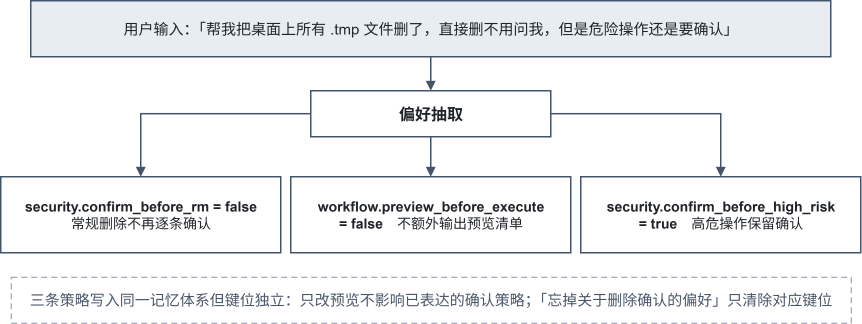

*图 10-1  单句输入中的多层安全策略抽取*

三条策略写入同一记忆体系但键位独立。此后用户若只想恢复预览，修改 `workflow.preview_before_execute` 即可，不会影响已表达的确认策略，这正是 4.1 节所述「避免策略缠在同一段文字里」的价值。

对应的自然语言遗忘同样按目标精确执行：「忘掉关于删除确认的偏好」只会清除对应键位，其余偏好不受影响。

### 10.3  场景三：跨场景工具选择共存

题目把「跨场景数据不一致」列为痛点。本项目的处理策略是**保留差异而非抹平**：

| 场景 | 用户请求 | 沉淀的工具选择偏好 |
| --- | --- | --- |
| 办公 | 把这个月日报整理成表格给我 | tool_selection.data_processing_tool = "excel"（办公场景范围） |
| 数据分析 | 用 Python 算一下这组数据的统计值 | tool_selection.data_processing_tool = "python"（数据分析场景范围） |

读取时按场景解析，两套取值同时保持最新，互不覆盖。真机验收中已验证该行为：同一用户在两个场景下的工具选择偏好可并存检索。

### 10.4  场景四：知识沉淀与复用

用户在操作过程中产生的可复用结论被沉淀为知识记忆，供后续任务直接调用；沉淀与复用构成一个完整闭环：

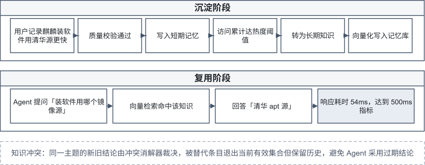

*图 10-2  知识沉淀与复用闭环*

知识冲突场景下，同一主题的新旧结论通过冲突消解器裁决，被替代条目退出当前有效集合但保留历史，避免 Agent 采用过期结论。

## 第 11 章  安装部署指南

### 11.1  环境要求

| 组件 | 要求 |
| --- | --- |
| 操作系统 | 银河麒麟桌面操作系统 V11（生产/验收）或 Windows 10/11、主流 Linux（开发） |
| Python | 3.10 及以上（真机验收需使用宿主较新解释器版本） |
| 向量后端 | 银河麒麟系统向量服务 / Milvus（生产）；进程内实现（开发） |
| 向量化后端 | 银河麒麟 Embedding SDK（真机）；本地 BGE-M3（开发） |
| 前端 | Node.js 18 及以上 |
| 可选模型服务 | 本地 LM Studio / 兼容 OpenAI 协议的推理服务（语义脱敏与模型抽取） |

### 11.2  Windows 开发机部署

适用于功能开发与单元测试：

```
cd <项目根目录>
python -m venv .venv
.venv\Scripts\activate
pip install -r requirements.txt

# 运行全量单元测试
python -m pytest tests/ -v

# 启动 API 服务
uvicorn api.server:app --reload --port 8000
```

环境自检：

```
python -c "from src.core.factory import create_orchestrator; o=create_orchestrator(); print('OK')"
```

### 11.3  银河麒麟 V11 部署

#### 11.3.1  环境变量

```
source .venv/bin/activate

export OS_AGENT_KYLIN_ACCEPTANCE=1      # 正式验收模式
export OS_AGENT_MEMORY_BACKEND=kylin
export OS_AGENT_EMBEDDING_BACKEND=kylin
export EMBEDDING_BACKEND=kylin
export OS_AGENT_KYLIN_STRICT=1          # 禁止回退到本地/哈希后端

# 系统向量化动态库
export KYLIN_EMBEDDING_LIBRARY=/usr/lib/x86_64-linux-gnu/libkysdk-coreai-embedding.so.1

# 系统向量检索桥接
export OS_AGENT_KYLIN_VECTOR_LIBRARY="$PWD/build/kylin-vector/libmokoa_kylin_vector_bridge.so"
export OS_AGENT_KYLIN_VECTOR_ENDPOINT=unix:/tmp/kylin-ai-vector-engine-1000.sock
```

#### 11.3.2  启动与健康检查

```
python -m uvicorn api.server:app --host 127.0.0.1 --port 18080

# 另开终端
curl --fail http://127.0.0.1:18080/health
```

健康检查返回示例：

```
{
"status": "ok",
"memory_backend": "kylin",
"embedding_backend": "kylin",
"kylin_strict": "1",
"vector_dim": "768",
"collection": "mokoa_kylin_sdk"
}
```

#### 11.3.3  一键验收

```
bash scripts/kylin_v11_full_acceptance.sh
# 或执行浏览器端到端验收（自动启动服务并保存截图）
bash scripts/kylin_v11_browser_acceptance.sh
```

| 验收脚本 | 覆盖范围 | 产出 |
| --- | --- | --- |
| 真机全量验收 | 环境检查、SDK 调用、端到端业务断言、记忆流转与遗忘 | 结果目录：汇总 JSON、健康检查、服务日志、各阶段证据 |
| 浏览器验收 | 对话、偏好召回、知识召回、遗忘的界面链路 | 结果目录：结构化结果与界面截图 |
| HTTP 功能覆盖 | 功能覆盖演示集 80 案例 | 明细结果与耗时 |

### 11.4  前端启动

```
cd frontend
npm install

# 指定后端地址
VITE_API_TARGET=http://127.0.0.1:18080 npm run dev

# 访问 http://127.0.0.1:5173
```

### 11.5  关键配置项

| 配置路径 | 作用 |
| --- | --- |
| configs/default.yaml | 全局默认配置：质量阈值、热度阈值、层容量、后端选择 |
| configs/adapters.yaml | 参考适配器开关（默认关闭） |
| 环境变量 | 密钥、后端选择、验收模式、动态库路径（优先级高于配置文件） |

> 安全提示：模型服务与向量库的凭据统一通过环境变量注入，默认配置文件中不应保留明文密钥。真机验收模式会拒绝回退到替代后端，以确保验收结果反映真实的端侧能力。

### 11.6  常见问题排查

部署与验收阶段反复出现的问题、定位路径与处理方式如下：

| 现象 | 原因定位 | 处理方式 |
| --- | --- | --- |
| SDK 返回 COREAI_EMBEDDING_CONNECTION_ERROR | SDK 将其定义为「向量化服务连接错误」，与模型文件无关 | 确认麒麟 AI 子系统在运行、socket 与 D-Bus 可达、当前用户具备权限；不要转为搜索 .onnx 文件 |
| 动态库加载失败 | libkysdk-coreai-embedding.so.1 缺失，或其依赖未满足 | 用 ls -l 与 ldd 确认库与依赖，用 nm -D 确认 text_embedding 等符号已导出 |
| 向量维度与存储层不一致 | 存储层维度取自配置，而非真实 SDK 返回值 | 先运行 SDK 采样得到真实 dimension，再设置 MEMORY_VECTOR_DIM，最后接入向量库 |
| 验收结果被判定为降级 | 运行期回退到了本地或哈希后端 | 设置 OS_AGENT_KYLIN_STRICT=1；健康检查接口应显示后端为 kylin 且 using_fallback 为 false |
| 预检脚本报错退出 | 环境变量或运行时依赖尚未就绪 | 按预检输出逐项补齐后再进入下一阶段，上一阶段失败时不要跳步 |
| 端到端测试长时间无输出 | 模型加载耗时掩盖了测试进度 | 先用预检与分阶段脚本验证依赖，再跑端到端；每阶段独立留存输出 |

需要向 SDK 提供方取证时，逐项留存下列原始输出，便于与错误码定义对照：

```
ps aux | grep -Ei 'coreai|embedding|kylin.*ai'
systemctl --user --type=service | grep -Ei 'coreai|embedding'
journalctl --user -b | grep -Ei 'coreai|embedding|connection'
ldd /usr/lib/x86_64-linux-gnu/libkysdk-coreai-embedding.so.1
```

## 第 12 章  用户手册

### 12.1  界面总览

演示前端提供六个功能页面，覆盖赛题要求的全部可演示能力：

| 页面 | 功能 | 对应赛题要求 |
| --- | --- | --- |
| 总览 | 记忆统计、分层数量、快捷入口 | (1) (6) |
| 写入记忆 | 四类数据源模拟写入，展示清洗与标准化结果 | (1) |
| 记忆列表 | 按类型筛选浏览记忆条目 | (1) (3) |
| 检索 | 自然语言检索，展示召回结果与响应耗时 | (3) (4) |
| 偏好画像 | 多维偏好展示、版本历史与当前生效值 | (2) |
| 遗忘 | 自然语言指令驱动精准遗忘 | (5) |

顶栏实时显示后端连接状态。若显示未连接，说明前端尚未指向运行中的 API 服务。

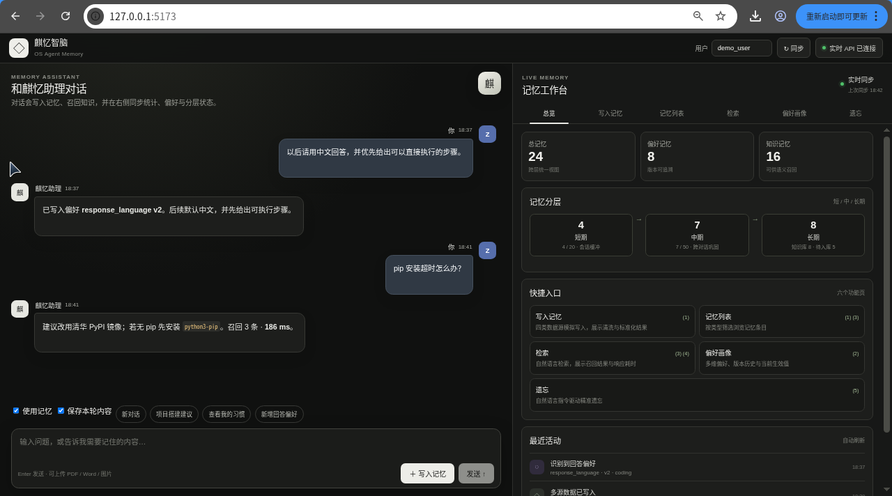

*图 12-1  前端主界面总览*

### 12.2  核心操作流程

#### 12.2.1  写入记忆

1. 进入「写入记忆」页，按数据源选择：文件 / 图片、工具结果、用户行为、手动配置、文本对话。

2. 填写内容后提交，页面返回质量分、是否接受、拒绝原因与抽取到的偏好键。

3. 若返回低质量拒绝，可按提示补充信息量或改为多次观测后重试。

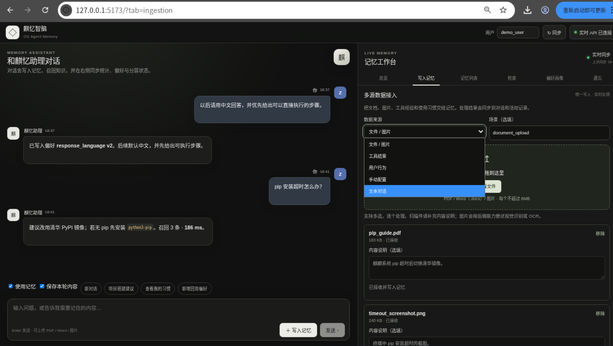

*图 12-2(a)  写入记忆页：对话写入与多源数据接入*

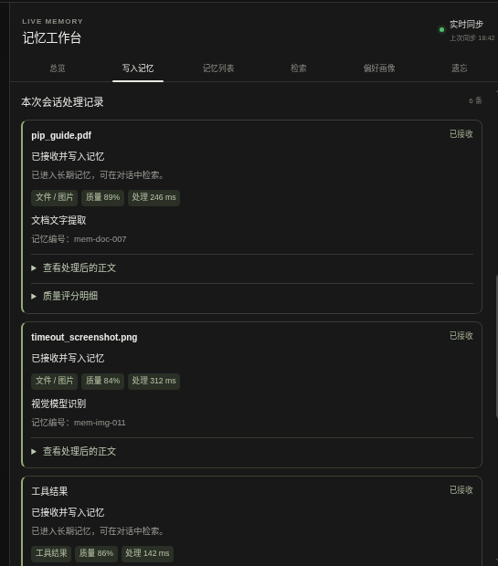

*图 12-2(b)  本次会话处理记录：各来源的质量分与处理耗时*

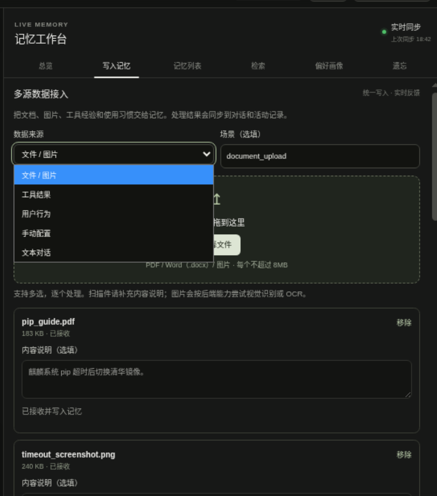

*图 12-2(c)  数据来源的五类选项与场景标注*

#### 12.2.2  查看偏好画像

1. 进入「偏好画像」页，选择用户与场景。

2. 页面展示当前生效的键值、置信度、观测次数与版本号。

3. 切换至历史视图可查看完整版本链，含被替代的记录与替代关系。

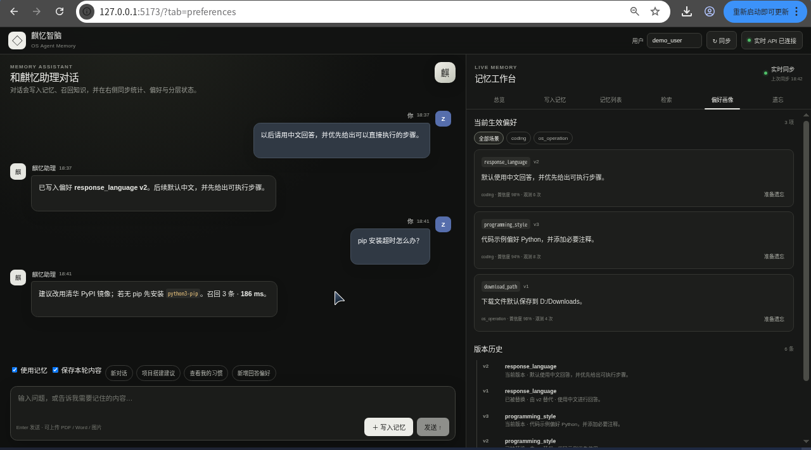

*图 12-3  偏好画像与版本历史*

#### 12.2.3  知识检索

1. 进入「检索」页，输入自然语言查询。

2. 可限定记忆类型与场景以提升精度。

3. 结果卡片展示内容、相似度分数、记忆层级与响应耗时；耗时徽标用于直观确认 ≤500ms 指标。

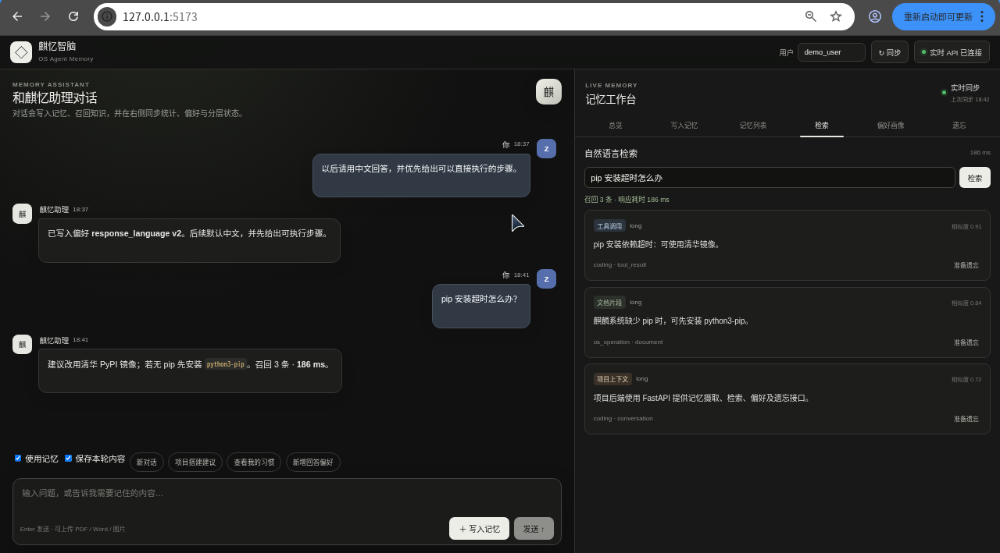

*图 12-4  知识检索与延迟展示*

#### 12.2.4  自然语言遗忘

1. 进入「遗忘」页，输入自然语言指令，例如「忘掉关于下载目录的偏好」。

2. 系统返回解析出的目标数量与删除标识列表。

3. 回到「偏好画像」页确认目标值已不再出现在生效偏好中。

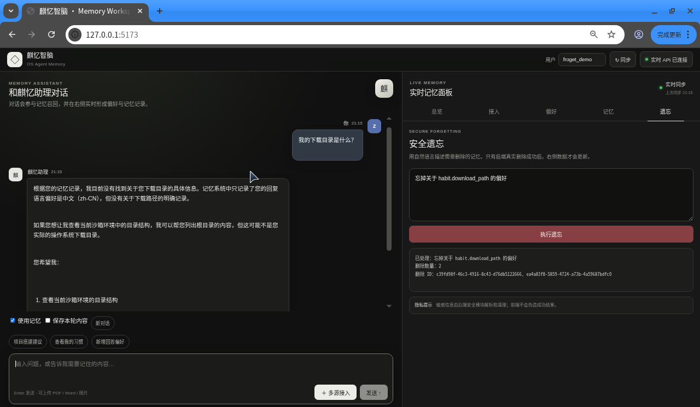

*图 12-5  自然语言精准遗忘*

> 遗忘是不可逆操作。建议使用独立的测试用户进行验证，避免影响正式账号的历史记忆。

### 12.3  接口清单

| 接口 | 方法 | 功能 |
| --- | --- | --- |
| /health | GET | 健康检查，返回后端类型、向量维度与集合信息 |
| /ingest | POST | 写入单条记忆（多源） |
| /ingest/file | POST | 上传文档或图片并摄取 |
| /short-term/{user_id} | GET | 查看短期记忆 |
| /mid-term/{user_id} | GET | 查看中期记忆 |
| /consolidate/{user_id}/mid | POST | 触发短期到中期晋升 |
| /consolidate/{user_id} | POST | 触发中期转入长期 |
| /store-entry | POST | 写入结构化记忆条目 |
| /preferences/{user_id} | GET | 查询当前生效偏好 |
| /preferences/extract | POST | 从文本显式抽取偏好 |
| /preferences/{user_id}/profile | GET | 获取结构化偏好画像 |
| /preferences/{user_id}/history | GET | 获取偏好版本历史 |
| /recall | POST | 关联检索长期记忆 |
| /forget | POST | 自然语言遗忘 |
| /stats/{user_id} | GET | 记忆统计与分层数量 |
| /staging/stats | GET | 中转库统计 |
| /staging/purge | POST | 手动执行中转库清理 |
| /agent/chat | POST | 对话入口，集成记忆召回与摄取 |

## 第 13 章  创新点与应用价值

### 13.1  技术创新性

本章汇总各章「机制创新点」小节的核心结论，完整论证与代价均见对应章节。赛题评审表的技术创新性对应偏好提取算法、知识冲突处理机制、关联检索策略三个重点，分别对应第 4 章的机制创新点小节与第 5 章第 5.5 节。

| 创新点 | 常见做法 | 本项目做法 | 解决的具体问题 | 详见 |
| --- | --- | --- | --- | --- |
| 偏好结构化 | 自由文本画像，整段嵌入检索 | 封闭偏好键空间、类型校验与规范化别名 | 偏好无法按键更新；度量口径不可定义 | 4.2、4.7 |
| 融合抽取 | 纯规则或纯大模型 | 规则保底、模型增强与降级标记 | 端侧断网或缺少密钥时功能不可用；成绩口径失真 | 4.3、4.7 |
| 版本与场景 | 全局单值覆盖，抹平场景差异 | 场景隔离版本链，追加式更新，supersedes 指针 | 配置版本混乱；跨场景习惯互相覆盖；无法回溯 | 4.5、4.7 |
| 置信度建模 | 黑盒分数或直接采信 | 来源基础分，配合频率、时间、否定、冲突、一致性五项可手算调校 | 无法解释为何采信某条偏好；冲突时静默选边 | 4.4、4.7 |
| 知识冲突裁决 | 按写入时间覆盖，后写胜出 | 来源等级、时间近因与语义一致性的多维裁决，保留替代指针 | 沉默覆盖导致历史不可回溯；互补事实被误判为冲突 | 5.2、5.5 |
| 关联检索策略 | 仅按用户过滤，其余条件在应用层筛选 | 结构化条件下推到存储层；默认只返回当前有效版本 | 无效候选与序列化开销；Agent 采用被替代的过期事实 | 5.3、5.5 |
| 端侧轻量化 | 假设始终可访问云端模型 | 统一后端工厂、验收强制系统 SDK、降级可观测 | 部署形态切换成本高；把降级性能误认为端侧性能 | 6.1、6.5 |
| 隐私与记忆分离 | 敏感信息与记忆同库存储 | 不可逆占位符入库，原文存于本地加密索引 | 记忆库泄露即隐私泄露；删除不彻底 | 7.3、7.6 |
| 遗忘粒度 | 仅支持按标识删除 | 自然语言驱动，覆盖脱敏索引、偏好、知识定向与批量四类目标 | 用户无法用自然语言表达删除意图 | 7.4、7.6 |
| 记忆流转与长期化 | 字符相似度合并，FIFO淘汰 | 向量余弦与关键词加权合并；近因衰减淘汰；模型抽象加护栏 | 跨对话同义碎片重复；陈旧内容挤占容量；模型污染权威字段 | 8.2、8.5 |
| 多源清洗与门控 | 单一函数完成清洗与入库 | 四段可断言管线、按来源构造正文、类型化质量阈值 | 脏字段污染向量；单次行为被误记为长期习惯 | 3.1、3.6 |

### 13.2  实用性

本方案直接面向 OS Agent 的记忆模块优化，实际价值体现在四个层面：

- **响应速度**：结构化偏好免去「整段画像再检索」的往返，真机端到端检索延迟落在 36ms 至 170ms 区间（见 9.3.3），为 ≤500ms 指标留出充足余量。

- **个性化准确度**：偏好按键位生效、按场景解析，避免跨场景习惯互相覆盖导致的「Agent 记错人」类体验问题。

- **知识复用效率**：可复用结论沉淀为结构化知识并进入检索，避免同类问题重复解释。

- **数据安全合规**：敏感信息不出本地，记忆库只存不可逆占位符，配合自然语言遗忘满足数据删除权的实际需求。

方案适配办公自动化、智能协作、个性化助手等多类场景，且端侧可独立运行，不依赖云端服务可用性。

## 第 14 章  已知约束与演进路线

### 14.1  当前已知约束

| 约束 | 影响范围 | 当前状态 |
| --- | --- | --- |
| 知识检索排序区分度不足 | 知识召回准确度 | 8 项未通过案例中占 4 项，为主要迭代方向 |
| 冲突裁决过滤顺序问题 | 知识冲突处理正确率 | 已定位，待修复并回归 |
| 重复抑制粒度偏粗 | 跨来源去重 | 已定位，需引入来源感知的去重指纹 |
| 大规模评测集缺失 | 指标可信度外推 | 现有最大评测集 35 条；知识召回与冲突消解为小样本 |
| 模型抽取在真机验收轮未启用 | 偏好抽取泛化能力 | 受端侧模型可用性限制，已保留降级路径 |
| 标记语言剥离不完整 | 清洗质量 | 已定位，属规则覆盖度问题 |
| 短句质量阈值适配 | 短偏好提取 | 阈值与表达长度的适配待优化 |

### 14.2  演进路线

| 优先级 | 工作项 | 预期收益 |
| --- | --- | --- |
| 高 | 知识检索排序优化（主题消歧、无结果显式判定、操作步骤类正文构造） | 直接提升知识检索召回率与答案忠实度 |
| 高 | 冲突裁决过滤顺序修复与回归测试 | 提升冲突处理正确率 |
| 高 | 扩充评测数据集规模，补齐大规模对比实验 | 使指标具备外推可信度 |
| 中 | 来源感知的去重指纹 | 降低跨来源重复条目 |
| 中 | 清洗阶段的标记语言剥离规则补全 | 提升清洗通过率 |
| 中 | 短句质量阈值自适应 | 提升短偏好提取覆盖 |
| 中 | 浏览器端到端真实 API 联调 | 补齐交付物中的联调证据 |
| 低 | 模型抽取在端侧模型可用时的默认启用 | 提升同义改写与跨语言泛化 |

### 14.3  结论

麒忆智脑以自研记忆编排核心为主线，把赛题 7 项要求逐条落到可运行、可验证、可回归的模块上。设计方案的核心判断是：**偏好记忆必须结构化才能被精确更新与度量，知识记忆必须结构化才能被可靠检索与冲突融合，而两者的端侧可用性取决于不依赖外网的能力下限。**

在银河麒麟 V11 真机环境下，主链 7 项要求已通过 HTTP 实跑验证，四类向量化落库、检索延迟与隐私保护链路均在真实系统 SDK 上得到确认。同时，项目如实记录了 8 项未通过案例与若干工程约束，并在第 14 章给出明确的演进优先级。这些不足是后续迭代的输入，而非需要回避的结论。

## 附录 A  术语表

| 术语 | 含义 |
| --- | --- |
| 记忆编排核心 | 系统的流程调度中枢，负责接入、分类、流转、冲突消解与统一入库 |
| 偏好键 | 形如 category.key 的结构化偏好标识，具有封闭取值空间 |
| 版本链 | 同一偏好键的历史取值序列，通过追加方式演进，支持回溯与回滚 |
| 场景隔离 | 同一偏好键在不同场景下维护独立版本，读取时场景优先于全局 |
| 热度 | 由访问次数、质量分与置信度合成的记忆活跃度指标 |
| 有效热度 | 在热度基础上叠加近因衰减后的淘汰依据 |
| 长期化 | 记忆由中期转入长期并写入向量库的过程 |
| 占位符 | 敏感内容入库时使用的不可逆哈希标识，形如 <HASH_xxxxxxxx> |
| 中转库 | 摄取阶段的 SQLite 存储，承担审计、TTL 去重与按需导出 |
| 降级 | 首选后端不可用时切换到备选后端的行为，始终显式标记 |
| R@5 | Recall@5 的缩写，前 5 条检索结果对标准答案的召回比例 |
| 摄取管线 | 采集、清洗、标准化、质量校验、去重五段构成的入库链路 |
| 质量分 | 摄取阶段对单条记忆可信度的评分，未经门控不得入库 |
| 场景标识 | 标注记忆适用场景的字段，读取时场景优先于全局 |
| 冲突消解 | 新旧取值矛盾时按来源等级与时间近因裁决，并保留替代指针 |
| 关联检索 | 向量余弦与关键词加权合并的检索策略，兼顾语义与字面命中 |
| 消融实验 | 关闭单项机制后与完整方案的对照，用于把指标变化归因到机制 |
| 短期记忆 | 会话内的原始摄取缓冲，进程重启后仍可恢复 |
| 中期记忆 | 质量达标且分类明确的条目池，淘汰按有效热度进行 |
| 长期记忆 | 长期化后的权威记忆，写入向量库并参与检索 |
| 真机验收模式 | 禁止回退到替代后端的运行模式，用于确认端侧真实能力 |
| 封闭键空间 | 偏好键取值限定在已注册键位内的设计，使指标可定义可复现 |

注册表按类别组织：六类键位共 **55** 条，值类型覆盖布尔、枚举、整数与字符串四种；场景标识共 6 个，作用域分为全局与场景两级。habit.likes、habit.dislikes 与 habit.possessions 三条按列表合并语义更新，同一偏好的多次表达合并而非覆盖。

*表 A-1  偏好键位注册表（按类别）*

| 类别 | 键位数 | 代表性键位 | 主要用途 |
| --- | --- | --- | --- |
| habit | 12 | habit.download_path | 文件、工具与开放域喜好 |
| style | 9 | style.reply_language | 输出语言、详略与格式 |
| security | 9 | security.confirm_before_rm | 危险操作确认与信息保护 |
| tool_selection | 8 | tool_selection.package_manager | 工具链与包管理器选型 |
| workflow | 9 | workflow.step_by_step_confirm | 执行流程与错误处理 |
| communication | 8 | communication.input_mode | 交互方式与确认强度 |

## 附录 B  证据索引

| 证据类别 | 内容 |
| --- | --- |
| 单元测试 | 44 个测试文件的 741 项用例收集结果；真机验收轮 279 通过、1 项跳过 |
| 偏好抽取评测 | 封闭键 35 条两种抽取口径；开放域 150 条词面与语义双口径结果，证据 `docs/evidence/dataset-eval-20260915/preference_20260915-133012.json` |
| 知识召回评测 | 真机 HTTP Recall@1 与逐条延迟记录 |
| 冲突消解消融 | 组件级正确率与「总是替换」基线对照 |
| 端到端验收 | 赛题 7 项主链 HTTP 实跑汇总与逐阶段证据 |
| 功能覆盖演示集 | 80 案例明细、判定与耗时 |
| 记忆流转补测 | 进程重启持久化专项补测结果 |
| 向量化验收 | 真机 SDK 调用结果、维度、相似度区分度与延迟分布 |
| 浏览器验收 | 界面端到端链路结构化结果与截图 |
| 数据整合验收 | 五段式摄取管线的字段留痕与质量门控结果 |
| 公开数据集评测 | MS MARCO、LongMemEval、TREC DL 等 13 个数据集的检索指标 |
| 延迟分布 | 端到端 P95 延迟与逐阶段耗时明细 |
| 系统 SDK 采样 | 麒麟 Embedding SDK 多次采样报告、维度一致性与区分度 |
| 环境预检 | 预检脚本输出的运行时、动态库与依赖检查结果 |
| 部署形态对照 | 云端、端侧与降级三条路径的可用性与行为对照 |
| 匿名与合规检查 | 交付材料中可识别身份信息的扫描结果 |
| 偏好种子演示 | 预置演示用户与偏好样本的可复现初始化 |
| 抽取方式对照 | 规则与模型两条抽取路径的字段级指标对照 |
| 规模召回数据集 | 自建召回评测集的构建脚本与统计口径 |
| 模型抽取冒烟 | 本地模型服务的可用性与输出形态抽查 |
| 检索桥接验收 | 系统向量服务的集合与过滤条件透传结果 |
| 配置基线 | 默认配置、适配器开关与环境变量样例 |
| 中转库留痕 | staging 库中的原始记录、TTL 去重与按需导出样例 |
| 遗忘操作审计 | 自然语言遗忘的解析结果与删除标识列表 |
